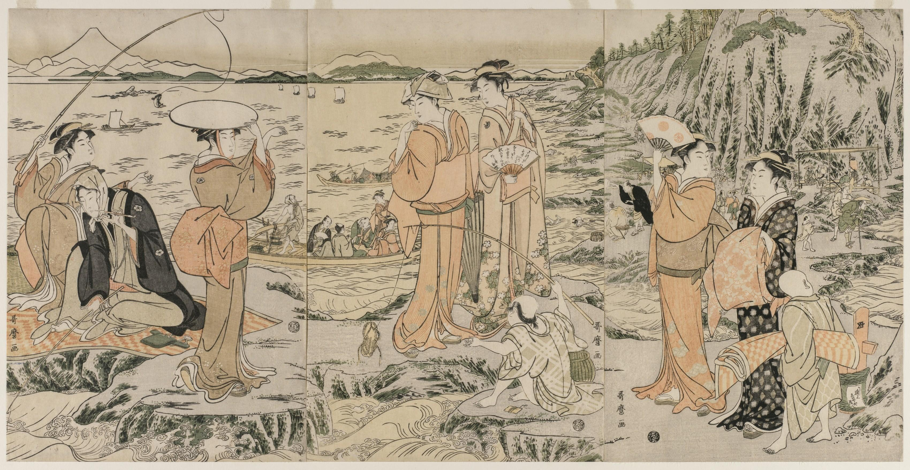
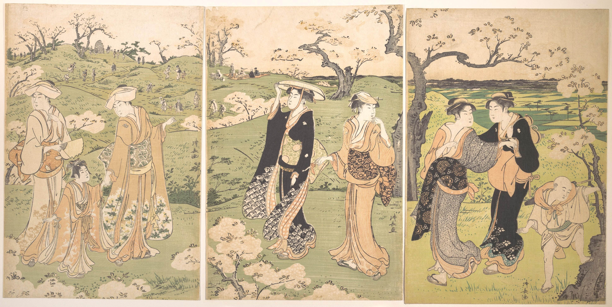

Graduation thesis by Naiya Hall, Hokkaido University. 
自動的に日本語翻訳されたのはこちら：[卒論](卒論.md)  
 
Back to [homepage](https://hall-n.github.io/)

(_updated Decembee 1, 2023_) 
# Understanding Edo Period Tourism: The Authorities’ Position Towards Pilgrimage

## Abstract
江戸時代の研究では、寺社参詣から生まれた観光産業が盛んであったとされているが、幕府や大名は奢侈や遊興を厳しく制限し、庶民の旅行に明確に反対していたと歴史家は主張している。本稿は、当局の立場を明らかにする。参詣がどのように商業化され、その産業が地域にどのような影響をされたかを見ることで、旅行からの経済的利益が明確になる。そして、これに対する当局の対応と政策を見ると、参詣者への支援や観光地の造成があり、庶民の経済的な幸福を追求する立場へ移行した事が分かる。従って、当局が参詣による観光産業の繁栄に明確な関心を持っており、その旅行が地域に悪影響を及ぼさない為だけに、旅行に制限を設けたと私は主張する。

While research has revealed that there was a thriving tourism industry born out of temple and shrine pilgrimages during the Edo period of Japan, some historians argue that the Tokugawa shogunate and the feudal lords were clearly opposed to travel by the general population and thus sought to severely restrict such movement. This paper questions that opposition and seeks to understand the authorities position towards travel and tourism. By looking at how pilgrimage was promoted, commercialized, and how the resulting tourism industry affected the regions around Japan, the economic benefits that the authorities as well as the regional population could gain from travel become clear. Furthermore, the responses and policies of the authorities to this industry indicate that there was a shift to a position of pursuing the economic well-being of the general population. In addition, there is evidence of direct support for pilgrims and the creation of tourist attractions. From these findings, I argue that the authorities had a clear interest in the prosperity of the tourism industry through pilgrimage and travel and therefore they placed restrictions on travel only to ensure that it does not have a negative impact on the community while allowing it to grow the regional economy.
# Thesis

## Table of Contents

[1. Introduction](#1-introduction) 
[2. Argument by historians](#2-argument-by-historians) 
[3. The commercialization of pilgrimage](#3-the-commercialization-of-pilgrimage) 
	&emsp; [3.1 Promotion by the _oshi_](#31-promotion-by-the-oshi) 
	&emsp; [3.2 The growing commodities of pilgrimage](#32-the-growing-commodities-of-pilgrimage) 
	&emsp; [3.3 The importance of tourism](#33-the-importance-of-tourism) 
[4. Response of the authorities](#4-response-of-the-authorities) 
	&emsp; [4.1 The permit system](#41-the-permit-system) 
	&emsp; [4.2 The Ōyama pilgrimage](#42-the-%C5%8Cyama-pilgrimage) 
	&emsp; [4.3 The _nukemairi_ pilgrims](#43-the-nukemairi-pilgrims) 
	&emsp; [4.4 The Shikoku pilgrimage](#44-the-shikoku-pilgrimage) 
	&emsp; [4.5 Non-religious tourism](#45-non-religious-tourism) 
[5. Changes in governance](#5-changes-in-governance) 
	&emsp; [5.1 Tokugawa bakufu](#51-tokugawa-bakufu) 
	&emsp; [5.2 The daimyo](#52-the-daimyo) 
	&emsp; [5.3 The influence of merchant thought](#53-the-influence-of-merchant-thought) 
[6. Conclusion](#6-conclusion) 
[Bibliography](#bibliography) 

##  Introduction

As Japan entered an era of peace in the beginning of the Edo period, the Tokugawa bakufu took steps to ensure that the daimyo would not have the means of uprising by implementing the alternate attendance system, which required the daimyo to make regular trips to Edo every other year (Park and Tanaka 2014). In order to facilitate this compulsory travel, the bakufu developed extensive infrastructure, building a centralized road network throughout Japan. To ensure that traffic flowed smoothly, the roads were regularly cleaned, wheels that would damage the surface were banned, and trees and shrubs were planted along the side of the road to provide shade and wind cover (Vaporis 1994). Along the main routes, post stations were established where businesses offered travel services, lodging, and food, and while they had to prioritize servicing Tokugawa officials and daimyo, they were allowed to cater to the lower classes. To monitor this movement throughout the regions, the bakufu positioned barrier stations along the road, through which passage required a permit. While travel of a purely leisurely nature was not officially recognized, permits were granted for pilgrimage or visiting an onsen for health reasons (Ando 2021; Goree 2020).

At the same time that the conditions for travel were greatly improved, the peasants and merchants began to find themselves with increasing financial freedom, which made travel more viable (Ishimori 1989). As advances in media captured the appeal of travel, with numerous guidebooks on famous sights and attractions being published, pilgrimage became increasingly popular (Fabricand-Person 2011). Over time, sightseeing and enjoying local specialties became common elements of the journey, sometimes even turning into the primary focus of the pilgrimage itself (Nenzi 2004; Yamamoto 1985). The roads soon became filled with pilgrims journeying to popular shrines and temples, travelers headed to hot springs, merchants plying their trade, transport laborers, and the poor and destitute who traveled while collecting alms (Vaporis 2012).

Just how prevalent travel was among all classes of society is noted by visiting Europeans. For example, Engelbert _Kaempfer_, a German physician and explorer who traveled through Japan in the late seventeenth century, claimed that the Japanese traveled more than any other people, describing them as being addicted to pilgrimage and claiming that the Tokaido highway was sometimes more crowded than the most populous towns in Europe (Kaempfer et al. 1906).

Despite the evident popularity of pilgrimage and travel, some historians (Blacker 1984; Kanzaki 1995; Traganou 2004) present the situation as the bakufu and daimyo authorities being clearly set against peasant pilgrimage and sightseeing, with some arguing that the bakufu sought to “discourage recreation, inessential travel, and other ‘unproductive’ uses of time” (Totman 2005, 265). The motivations of the authorities remain open to debate, however, as research by Vaporis (1994, 2012) on travel infrastructure and the permit system overturns previous assumptions of the bakufu’s nature of being authoritarian, intrusive, and closely regulating all aspects of society. Vaporis observes that the checkpoint officials dealt with travelling commoners with an increasing measure of laxity, in contrast to the strictness they showed to samurai and the upper classes. In addition, the changes the bakufu made to the permit system appear to be so that travel permits for pilgrimage could be obtained more quickly and easily, encouraging applying for a permit instead of leaving without one. Vaporis concludes that the authorities were trying to accommodate the large numbers of people who wanted to travel, while still monitoring the checkpoints for daimyo movement.

In light of Vaporis’ findings, a question arises: if the authorities were positioned against the travel and pilgrimage of commoners, then why do we observe such lenience towards it? In this paper, I argue that the answer to this question lies in the economic elements that arose from pilgrimage, namely, the tourism industry. The market economy was of great importance to the bakufu and daimyo, as my previous research (N. Hall 2022) revealed in their efforts to manage the rice market and increase agricultural yields; therefore, the economic benefits to be gained from pilgrimage are highly relevant to understanding the intent behind regulation towards it.

To make the connection between the authorities’ lenience and their economic priorities, an understanding of the situation surrounding pilgrimage and why it became so popular is necessary. First, a review of historian’s arguments and an outline of Vaporis’ findings. Following this, a short explanation of the permit system and how the changes made to it enabled commoners to acquire a travel permit more easily. Next, examining those who began to promote pilgrimage, the shrine and temple affiliated _oshi_, reveals economic motivations as these religious institutions sought financial support from pilgrims to supplement the lost funding from the bakufu. As the number of pilgrims increased, the surrounding communities began to compete for their business, which resulted in the rise of the tourism industry, an industry that became important for many regions across the country. Analyzing how the authorities responded to this industry reveals their underlying economic incentive, as they make efforts towards keeping incoming pilgrimage from harming the region and surrounding communities, while at the same time ensuring that business could sufficiently profit from it. In addition, evidence of the bakufu’s direct creation and promotion of tourist destinations is presented, revealing a clear desire to grow the tourism industry. Finally, from these observations I argue that the lenience towards the pilgrimage of the lower classes by the bakufu and the daimyo was the result of these authorities being primarily concerned with the economy and their recognition that pilgrimage could further the prosperity of their region.  

## 2. Argument by historians
In the literature that presents the idea of the bakufu and daimyo being positioned against pilgrimage, many of the historians only mention it lightly and do not elucidate on why the authorities would be averse to this travel. There are a few, however, that have stated specifically that the bakufu perceived pilgrimage to be a threat due to its anti-structural elements. For example, Traganou (2004) claims that pilgrimage meant abandoning one’s occupation and was used as an escape from the restrictions of Edo period society. Blacker (1984) similarly argues that undertaking such travel meant that farmers were neglecting their proper duty, thus the daimyo likely viewed pilgrimage as “frivolous, useless, extravagant and immoral” (ibid, 604). Though Blacker does admit that some daimyo did not object to pilgrimages which were undertaken during the idle part of the year, she nevertheless claims that the authorities saw this travel as playing no useful part in human society and a threat to order and stability. However, this argument could be due in part to how Blacker herself views the pilgrim. In her writing, she presents this traveler as a wandering mendicant who wishes to escape from the rules of society, an image which places considerable weight on only a single pilgrim architype despite there being many reasons and situations surrounding pilgrimage (Ambros 2008). This antisocial element that both Traganou and Blacker claim to be the root of the authorities’ opposition is therefore not necessarily an element of all pilgrimage.

Other arguments that might explain the authorities’ position against pilgrimage point to the negative economic factors that came from travel, as Traganou claims that it could interfere with the farmer’s agricultural production, to which both the bakufu and daimyo’s finances were directly tied. In addition, some pilgrimages upset the local economies, “causing inflation of the prices of rice, straw, lodgings and other necessities” (Traganou 2004, 72). While Traganou unfortunately does not go into detail on how such inflation would occur, a counter argument has been made by Ambros, who contends that popular destinations often develop the infrastructures needed to deal with the influx of pilgrims as commercialism becomes a part of pilgrimage. In addition, Traganou only points to negative effects that pilgrimage had on the economy, while Ambros cites cases that had a positive impact and received support from authorities.

While Traganou’s argument may be questionable, a concrete example that might support it can be found in Vaporis’ research that discusses economic repercussions of travel. He points to the example of the Kaga domain restricting pilgrimage to a popular Kyoto shrine, claiming it was to “stem the outflow of precious domain resources like gold and silver” (1994, 202). Vaporis speculates that travelling into other regions could be a valid concern for the ruler because it could lead to the loss of domain financial resources. However, on the other side of this argument is that having a popular pilgrimage destination within your domain could likewise be an attraction for incoming resources from other regions. In either case, the determining factor here might not to be an overall opposition to commoner’s pilgrimage itself, but to the economic consequences that came from that travel. Still, the above arguments reveal that at least some pilgrims gave the authorities cause for concern.

When looking in more detail at the legislation towards pilgrimage, however, a hard position of the authorities against pilgrimage becomes more difficult to ascertain. In Vaporis’ study of the road barriers and travel permit system, he challenges the idea that the authorities fully controlled the movements of the lower classes, arguing that the commoners found ways to circumvent the barriers. He claims that this reality reflects the authorities’ tolerance of travel and the flexibility of the system they implemented, describing the many cases of laxity where checkpoint officials allowed passage for commoners without permits or let slide their permit related offenses. Quite contrary to the idea of dealing with commoners harshly, “[o]fficials frequently bent the rules for travelers with defective permits, and sometimes downgraded travel offenses to avoid having to prosecute commoners” (ibid, 216). After his review of government policies regarding travel, Vaporis concludes that they were “on the whole, positive rather than repressive” and quite flexible (ibid, 5). He claims that “[t]his growing flexibility in a system that originally had been more rigid allowed for - and in fact promoted - the increasing mobility that characterized Tokugawa Japan from the eighteenth century on” (ibid). For this reason, he warns against accepting a “legalistic interpretation of Tokugawa Japan” (ibid, 6), as doing so overestimates the state’s authority and incorrectly represents the commoner as immobile, with their movements severely regulated and strictly inspected at barriers. His conclusion is that the barrier stations did not significantly impede commoners and that regulations towards that travel “were inspired mainly by economics rather than a desire for totalitarian control” (ibid, 198).

While Vaporis’ research is noteworthy and presents significant findings, the question of why the authorities were so lax in allowing pilgrimage is one that he does not directly touch on, as Nosco (1996) has noted in his review of Vaporis’ work. Among the few comments that Vaporis makes regarding the _intent_ of the authorities, there is the claim that the daimyo and bakufu idealized the population being tied to the land. While this may not be the same as being against commoner pilgrimage if it did not negatively affect their agricultural responsibility, in Vaporis’ conclusion he remarks that the “regulations, while not without some effect, were not able to stem the irrepressible desire of the masses in Tokugawa Japan to travel” (1994, 198).

Although Vaporis’ position may be difficult to ascertain, from his observations the restrictions toward travel appear to be connected to economic elements. The question is, did these restrictions come from an opposition to pilgrimage and tourism in itself? A possibility is that the travel regulations reflect the underlying motivation to stem only certain travel that could harm a region’s economy, while promoting pilgrimage that could positively increase that economy. Indeed, Vaporis even observes some domains regulating pilgrimage by having specific economic qualifications required to obtain a travel permit, though unfortunately he does not take the argument further as his research question lies in _how_ the authorities reacted, not _why_. Despite his and the other historians referenced above focusing largely on the negative repercussions of some pilgrims, I argue that there are also cases of pilgrimage that had a positive economic impact due to the touristic elements that came with it. To see these effects in perspective, a review of what research has revealed about the factors that led to pilgrimage travel being commercialized and giving rise to tourism is necessary.

## 3. The commercialization of pilgrimage
### 3.1 Promotion by the _oshi_
In recent years, historians have begun to approach the topic of Edo period travel from many different angles, asking new questions about why pilgrimage became so widely practiced and how travelers interacted with their destinations, slowly revealing that the travels of pilgrims turned into what we recognize today as contents tourism (Seaton et al. 2017). While some elements of this tourism date back to before the Nara period, such as the buying of amulets and travel souvenirs, the commercialization of pilgrimage grew to new heights during the Edo period to “become the dominant medium through which places were experienced” (Wigen 2010, 298), leading to a common type of pilgrim that has been described as a “consumer tourist” (Nenzi 2004, 286).

Examining the factors of how pilgrimage increased and came to be commercialized reveals the economic motivations of parties who worked to popularize it for their own financial gain. The instigators of that promotion are what have been described as the first travel agents: the temple and shrine affiliated _oshi_, who acted as “mediators between the shrine and the people” (Kanzaki 1995, 44). In the beginning of the Edo period, religious institutions began to lose financial support from the bakufu, and in an attempt to compensate for this, they worked to attract pilgrims to their shrines and temples. These _oshi_ were the key players in growing the popularity of pilgrimage, as demonstrated in Ambros’ research (2008) of Ōyama, a mountain shrine and temple complex located in the Kanagawa Prefecture. She argues that it was due directly to the efforts of the _oshi_ that the Ōyama religious site transformed into such a major tourist destination. These _oshi_ appealed to pilgrim travelers by promoting shrines and temples and then arranging for the pilgrim’s accommodation, providing tour guides, and offering useful travel information (Umesao 1995). While originally much like a missionary on behalf of their shrine or temple, over time they became more merchants than priests, each with their own territory (Kanzaki 1995).

An important element of the _oshi_’s promotion was the level of hospitality and entertainment that they offered pilgrims, such as preparing luxurious silk bedding and providing extravagant banquets that made use of the local gastronomic specialties. They also presented souvenirs and gifts to the pilgrims. However, underneath this “hospitality lay a cunning business spirit. What they intended was advertisement with maximum effect” (ibid, 48). After the pilgrims returned to their village, they would talk about the luxury they enjoyed, and this would lead to additional pilgrim recruitment for the _oshi_. The financial gain that came from pilgrimage was not something that was felt by shrines and temples alone, however. While talismans and religious offerings were important elements of one’s pilgrimage, the commercial potential of this travel was much larger.
### 3.2 The growing commodities of pilgrimage
An example of pilgrimage’s commercial potential is _meibutsu_ (famous products), which became an important element for travelers, and many locations began advertising their local specialty cuisine as a marketing strategy in order to promote their popularity. Nenzi (2004) observes that the creation of many popular travel destinations was owed specifically to the presence of a _meibutsu_. “Gastronomies and knickknacks provided a convenient way to forge a link with a travel destination for those who did not wish to experiment with the ethereal and often slippery pillow words of poetic travel” (Nenzi 2008, 155). While following in the footsteps of famous lyrical travelers, such as Matsuo Bashō, was becoming quite popular, no longer did a formal education preclude the traveler “from symbolically ‘owning’ a site—all it took now was a string of coins and, sometimes, an appetite” (ibid). The consumption of these non-religious elements grew to be widely popular, and to the demand of these pilgrims the tourism industry responded with merchandise. The souvenirs brought back to the pilgrim’s hometown became an important aspect of the trip itself, as it gave validation of one’s travels and offered the experience with those of the village who could not visit themselves.

Like tourism in modern day Japan, a wide variety of industries took advantage of their link to the region or religious site and marketed themselves as _meibutsu_. For example, the port town of Marugame in northern Shikoku sold many souvenirs for the nearby Konpira Shrine, a famous pilgrimage destination. Among those advertised were not only locally made fans that had a direct association with the shrine, but they found ways to link locally produced oil, miso, and medicines to the shrine’s deity (Thal 2005). Furthermore, it was not physical products alone that took advantage of pilgrims, as teahouses and brothels sprung up along the pilgrimage routes. These quickly became popular stops along one’s journey (Oshida et al. 2011), with some prostitutes becoming famous _meibutsu_ themselves (Nenzi 2004). The popularity of these non-religious elements was in turn taken advantage of by shrines and temples, “making recreational goods and services available within or just beyond their gates” (Goree 2020, 8). 

Figure 1: Roadside tea house at Fuchu station on the Tokaido highway, selling a famous _meibutsu_, the Abekawa rice cake. By Andō Hiroshige.
_Source_: Wriston Art Center Galleries.

The effects of pilgrimage, therefore, were felt far beyond the industry of travel, and created a situation of competition between regional businesses and religious sites. From that competition cases of conflict did arise, something which the aforementioned historians point to when they discuss the dangers of pilgrimage; I would argue, however, that even the negative effects that pilgrimage had on a community serves to outline just how significant of an industry it was becoming to the region.
### 3.3 The importance of tourism
The growing size and significance of the travel and tourism industry can be seen in Nenzi’s research (2004) into the interactions of pilgrims and their destinations over the course of the Edo period. Using as a case study the region of Sagami, located in modern day Kanagawa Prefecture, Nenzi traces the many cases of conflict between regional parties who competed for profits from these pilgrims. To resolve this conflict, the parties turned to the regional governments and Edo authorities to stop practices that were causing a decline in pilgrim visitors.

In one example from 1650, the head of a temple of the goddess Benzaiten in Enoshima complained that local fisherman were selling the deity’s amulets and leading travelers to their own establishments, instead of telling them how to reach the temple’s lodgings. This resulted in a loss of income for the temple, thus they petitioned the shrine and temple magistrate in Edo to put a stop to what they felt were illegitimate inns. The response from the magistrate was a compromise, allowing the private non-temple affiliated inns to be run when there was an overflow of travelers which the temple could not accommodate. As for the amulet distribution, it could continue as long as “those who benefited from it also provide public services to the temple” (ibid, 306). Despite this ruling, the fishermen and other local entrepreneurs continued to target pilgrims, and over the decades tensions between them and the temple persisted. Nenzi observes the temple’s efforts of commercialism in response to this, as they offered various accommodations packages and special amenities and provided elaborate meals and entertainment to guests. The attractions that drew pilgrims to this area thus developed into a commodification of local history and regional specialties, revealing a new common type of pilgrim that Nenzi calls the “consumer tourist” (ibid, 309). As reflected in the woodblock print of the late eighteenth century (figure 2), pilgrims that combined religious sentiment with touristic intent became a common sight in Enoshima. As commercialism flourished and “icons of the past became the trinkets and menu items of the present, the modalities of the interaction between visitors and sites also expanded dramatically, taking on new nuances that did not replace but complemented the old ones” (Nenzi 2008, 154). By the nineteenth century the number of pilgrims grew to the point that the temple infrastructure could not handle their accommodation, which lessened the tensions between competition. Observing how the pilgrimage scene unfolded at Enoshima reveals that it was clearly a key point in the economic growth of this region.

Figure 2: Tourists enjoying fishing at Enoshima. By Kitagawa Utamaro.
_Source_: The Cleveland Museum of Art.

A similar trend of competing for the profits from pilgrims can also be observed in the region around the Ōyama shrine and temple complex, where in the latter part of the eighteenth-century quarrels arose over packhorse fares and lodgings of pilgrims (Nenzi 2004). By 1840 local inns and village leaders made an agreement to resolve the issues of lost profit from pilgrims by lowering ferry fares and eliminating regional tolls, which had been causing travelers to choose alternate routes. “These official ordinances and self-imposed codes of conduct intended to regulate the proliferation of traffic indicate the growing complexity of the space of travel and the increasing weight of consumer logic” (ibid, 309). The importance of this consumer logic surrounding pilgrimage is also noticed by other historians, as Ambros (2008) observes how providers of services and goods catered to the growing desires of pilgrims, which fueled the regional economy and over time many local businesses came to rely on Ōyama pilgrimage.

Similarly, in other areas of Japan religious institutions worked with the local region to promote pilgrimage. Thal’s research (2005) into the Konpira religious site in northern Shikoku, a destination which rivaled the Ise shrine in popularity, shows that the growth of this site was not due to its religious significance alone; it relied on business owners as much as it did on the priests, and the popularity of this location developed in tandem with the surrounding markets and entertainment. To raise income as well as the religious status of the shrine, “[t]he priests of Konpira, like priests of other would-be pilgrimage sites, simultaneously developed the attractions of both the god and the town to boost the economic viability of the sacred domain” (ibid, 74), holding lavish festivals and parades which they timed with events in the nearby town. A similar phenomenon that Thal argues was common to many pilgrimage sites of Japan and around the world, the Konpira religious complex “grew amid a bustling pilgrimage economy of entertainments and commerce: performances, prostitution, and gambling proved as integral to the growth of the site as amulets and worship” (ibid).

This mixing of religious and worldly elements in turn became an opportunity for the daimyo, as reflected in how the Konpira religious group rewarded regional lords in exchange for their patronage by offering social benefits that “legitimized, protected, and enhanced” their prestige (ibid, 76). Thal describes how the support of three nearby daimyo mutually benefited all parties, “weaving the sacred domain of Konpira - oustide the formal boundaries of any of the three larger domains - into an expanding network of personal, economic, and ritual relationships” (ibid, 78). The religious popularity of the Konpira site, which was fueled by the pilgrims who traveled to it, thus came to be of importance to these daimyo, affecting their social and economic power. “The development of a widespread pilgrimage culture in the nineteenth century both relied upon and enabled the growth of economic networks of consumption, advertising, and offerings” (ibid, 98). As these networks grew, they contributed to the growth and development of the economy, society, and “a multifaceted culture in which the gods play an integral part” (ibid).

These examples demonstrate how important the commercial elements of pilgrimage in the Edo period came to be for a region’s business, its shrines and temples, and the ruling daimyo. It greatly affected the regional landscape, with existing towns flourishing, and new towns forming around popular shrines and temples, both which were due to the direct results of pilgrimage (Ishimori 1989). In turn, the popularity of a religious site could benefit the regional lords in exchange for their patronage. The economic significance of pilgrimage would therefore not be dismissed by the bakufu or daimyo just because the peasant was responsible for agricultural production. Despite the idea that the authorities viewed the peasant as someone who should stay tied to their land, as argued by Vaporis, catering to these pilgrims “by providing food, lodging, and entertainment at religious sites was the foundation of much of the modern Japanese tourism industry” (Seaton et al. 2017, 20). Furthermore, in the above cases the authorities’ response to the conflict over the competition of pilgrims in Enoshima and Ōyama appears to be neutral towards pilgrimage itself, as their reaction is more aimed towards responding to the needs of the business community. To assess the bakufu and daimyo’s position towards travel more definitively, it is necessary to review in more detail the permit system itself and other cases of authorities’ involvement with pilgrimage and its tourism, where they show both positive and negative reactions.
## 4. Response of the authorities
### 4.1 The permit system
In order to pass through the many road barriers, one needed to have a permit, of which there were largely two types: a transit permit (_sekisho tegata)_ and a passport (_ōrai tegata)_. The transit permits appear to have been commonly used from the beginning of the Edo period and were made for specific barriers, where they would be handed over by the traveler when they passed through. These permits were issued by the bakufu and daimyo officials, and while they could be drawn up for the traveler at their place of departure, they were also issued at locations close to the barrier (Yamamoto 1985).

The passports, however, emerged later in the middle of the Edo period. They were not surrendered to barrier officials and were carried by the traveler throughout their journey. While largely distributed by shrines and temples (ibid), they could also be issued by village officials, post stations, and sometimes innkeepers (Vaporis 1994). These passports were much easier to obtain, and their emergence reflects the loosening of restrictions on commoner travel as the popularity of pilgrimage grew, Vaporis argues. “The application of Tokugawa law was at times unpredictable and random, but it could also be flexible, for it was a traditional principle in Japanese law that reason should prevail over custom and precedent” (ibid, 179).

Observing the changes that the bakufu made to the permit system over the course of the Edo period, Vaporis concludes that they were not to discourage pilgrimage itself, but rather to encourage travelers to apply for a permit instead of leaving suddenly without one. This pilgrimage taken without permission was called the _nukemairi_, and more details on why the authorities might want to discourage it will be discussed in a following section.
### 4.2 The Ōyama pilgrimage
A case of the authorities’ positive response to commoner’s travel can be seen in the pilgrimage to Ōyama. In Ambros’ research (2008) into this a religious site, which over the course of the Edo period gained tremendous popularity, she argues that the reaction of the bakufu toward pilgrimage depended on how exactly that pilgrimage was conducted. In looking at the make-up of Ōyama pilgrims, for example, she observes that they were largely from confraternities, where the members “pooled their funds to finance the pilgrimage, and therefore the pilgrims were not a burden on communities along the route but fueled the regional economy” (ibid, 16). While there were poor pilgrims who were given alms by the villages they traveled through and thus could be argued to be an economic burden to those regions, Ambros’ observations clearly show that many pilgrims were far from destitute and had the resources to cover the cost of their journey. 

Furthermore, Ōyama pilgrimages usually took place before harvest, sending only a select few members of the community and thus village life was not disrupted. In addition, these pilgrimages were not for the sake of a single individual, but undertaken on behalf of the entire community, as the pilgrims would bring back amulets for everyone. These positive social aspects of pilgrimage, Ambros argues, is one reason that the bakufu were not against it. “The few regulations that pertained to it were not so much meant to limit the pilgrimage to Ōyama but more to ensure that pilgrims did not extend their pilgrimages unduly and maintained order on their journeys” (ibid, 173). These community-building aspects of pilgrimage have been noted by Japanese historians as well, who argue that pilgrimage reinforced social harmony and the experience from that travel was highly valued as a rite of passage, pointing out that it created solidarity among families and fellow pilgrims (Park and Tanaka 2014; Shinno 2002).

To illustrate that the type of pilgrimage directly affected the response of the bakufu, Ambros contrasts their support of Ōyama by pointing out how the bakufu outlawed confraternities of Mt. Fuji several times during the eighteenth and nineteenth centuries. The reasons behind their actions have been argued to be due to how the Fuji cult was managed and how its members acted. As Tyler (1981) explains, this was a new religion without any connection to an established sect and therefore illegal by definition. In addition, the cult had troublesome practices, such as frequently refusing to provide sick pilgrims with any other medication besides the holy water from Mt. Fuji and chanting while handing out talismans outside people’s gates. Finally, because the devotees were a mingling of commoners and samurai, the bakufu were concerned with potential subversion. In other words, it was suppressed not because the bakufu sought to curb the practice of pilgrimage, but because this specific sect was seen as problematic for the region and socially disruptive.
### 4.3 The _nukemairi_ pilgrims
Another type of pilgrim that was seen as problematic was the _nukemairi_, the absconding pilgrimage taken without permission of one’s home community and without applying for any kind of permit before departure (Ambros 2008). Because these travelers did not have a permit, they usually evaded the road barriers, something done “without great concern about possible punishment, implying that the authorities gave tacit approval of the short-cuts or that punishment was rarely exacted” (Vaporis 1994, 191). Another option besides evading barriers was to obtain a permit along their journey, a practice which the authorities did not take a firm stance against. If the pilgrims returned home with amulets for their community, their pilgrimage without permission could be forgiven. Nevertheless, this type of unauthorized pilgrimage was one that garnered opposition from the pilgrim’s communities as well as the authorities and was seen as selfish and an inconvenience to one’s family and master (Traganou 2004).

As an example of these potential issues can be seen in why the Osaka City Magistrate prohibited _nukemairi_. They claimed that it was a threat to civil peace, describing how pilgrims were “without discretion, simply dropping what they were doing and leaving home, neglecting to shut doors or put out fires” (Vaporis 1994, 207). There were also instances where _nukemairi_ pilgrims left infants and elderly unattended, and a case of too many apprentices suddenly leaving at once and causing a labor shortage. The Osaka authorities, therefore, deemed _nukemairi_ to be causing harm to the region and its economy and thus discouraged it.

Perhaps such an example is why _nukemairi_ is often referenced when historians (such as Blacker and Goree) comment about the authorities’ strictness of pilgrimage. Indeed, Ambros points out that the _nukemairi_ type of pilgrim is “partially responsible for the pervasive view of pilgrimage in the early modern period as a disorganized and even subversive activity” (2008, 145). While there are clearly community concerns surrounding _nukemairi_ pilgrims, being against sudden pilgrimage taken without permission is not the same as being against all pilgrimage and or travel in general. Furthermore, from the various changes made to the permit system to discourage _nukemairi_ (as discussed previously on page 16), the authorities appear to be distinguishing between pilgrimages. One could argue that their intention behind the constraints on this travel was not meant to restrict the commoner’s movements but put in place to only limit the pilgrim’s potential negative repercussions on their home region, in other words, to encourage people to gain community permission before undertaking a journey.
### 4.4 The Shikoku pilgrimage
While the _nukemairi_ pilgrims have been argued to have been largely associated with pilgrimage to the Ise shrine, another type of traveler that similarly had a negative image was the “solitary, mendicant pilgrims” (Ambros 2008, 145), who traveled around the Shikoku circuit pilgrimage of eighty-eight religious sites, a journey that usually took a period of months. This pilgrimage was often undertaken by individuals or small groups who were not connected to religious associations or confraternities, unlike pilgrimages of Ise and Ōyama who had religious institutions promoting and managing the pilgrim’s travel directly. Ambros argues that this mendicancy was view by both bafuku and daimyo authorities as disruptive and antisocial because they “perceived religious travel as a burden on the communities that hosted pilgrims as well as on the home communities left behind” (ibid). The bakufu therefore instituted constraints to counter that burden, such as travel duration and specifying a specific route which must be taken. These constrains are often referenced by historians (such as Vaporis) as cases where the authorities were more restrictive towards pilgrims, and Blacker (1984) uses this type of pilgrim in her argument that pilgrimage was used as a way of escaping the restrictiveness of Edo society: by cutting their moral ties and putting themselves outside the vertical hierarchy, they gain the freedom much like the outcasts and divine wanderers. Traganou (2004) also argues that this liberation from social responsibilities and hierarchy that attracted pilgrims was seen by the bakufu as subversive and therefore posed a threat to their authority.

It is important to realize, however, that those constraints might have been instituted to protect the region. As Kouamé (1997) argues, the restrictions towards the Shikoku circuit pilgrimage are likely linked to travelers who took advantage of the custom of locals giving alms to pilgrims. While there are certainly many constraints, when looking at the level of freedom that the Shikoku authorities granted pilgrims as they passed through, Kouamé argues that the restrictiveness of the regulations were comparatively insignificant and amidst the many regulations was a clear tolerance to encourage a positive pilgrimage industry. While the Shikoku authorities did specify a certain route to travel and forbid disorderly and disruptive behavior, they also had to provide support for those in need.

Under the rules of this support system that was established by the bakufu in the seventeenth century, if a traveler died on their journey, they were to be buried locally. If they fell ill, the local officials had to ensure that the traveler saw a doctor and received adequate medical treatment. In addition, should the traveler wish to return home, the inns and villages along the route were responsible for transporting him back to his home village and were obliged to cover that cost, should the traveler be unable to pay for it (Ando 2021). Looking at the number of pilgrims that the authorities helped return to their home regions when they found themselves unable to finish their journey was “quite significant”, Kouamé argues, and “[i]t is clear that such assistance was standard practice” (1997, 423). While the Shikoku authorities may have just been following the regulations laid down by the bakufu, even so they should not be analyzed in terms of only oppressive control, because it is clear that they helped pilgrims in trouble.

There was, of course, punishment for violation of rules or the ability to deny pilgrims entrance to a province. In one such instance in the early nineteenth century, two sick pilgrims who were undertaking the Shikoku pilgrimage in hopes of it curing their illness were denied entry into Tosa, the southern region of Shikoku. The authorities of Tosa are believed to have been the most severe towards pilgrims, but in looking closely at the situation of the region at this time, Kouamé observes that Tosa was experiencing a famine, and thus the authorities were likely trying to prevent the sick pilgrims, who they feared might stay in the province beyond their allotted time, from becoming a burden to the locals. This example demonstrates that the background of the situation surrounding actions taken against pilgrims needs careful consideration, because the caution exercised by the Tosa authorities may be not a reflection of their position against the practice of pilgrimage, but against a specific case where it could have negative regional repercussions. Kouamé argues that even in such cases where those elements existed, they appear “to have had no influence on the general attitudes of local authorities towards common pilgrims” (ibid, 419). She concludes that the case of Tosa provides “an example of the degree of tolerance seen in an administration renowned for its severity and the degree of flexibility of a social system known for its rigidity” (ibid, 414).

Therefore, while some historians may use the Shikoku circuit pilgrimage or the _nukemairi_ pilgrims as an example of the authorities’ opposition of pilgrimage, upon closer examination they reveal evidence of both the bakufu and the local daimyo’s support of the pilgrims during their journey. As seen in the cases above, the authorities do not appear to be opposed to all pilgrimage; how that travel was conducted and how it affected the local region seems to be a deciding factor in how they responded to it.
### 4.5 Non-religious tourism
The cases above reflect the bakufu and daimyo’s reaction towards pilgrimage specifically, but if we consider the argument of the historians once more, they often mention the authorities’ negative stance toward leisure and sightseeing, pointing out that this was a large reason for the position against pilgrimage, since it often had touristic elements (Blacker 1984; Traganou 2004; Vaporis 1994). This argument, however, is not convincing because there are cases where the bakufu directly promoted tourism.

An example of this can be seen in how they dealt with the media industry that promoted travel, which included guidebooks, maps, and travel diaries. If the bakufu had sought to curb commoner travel, letting information relating to it flourish seems highly counterproductive, yet they did not monopolize or control spatial information and allowed free use of map images (Yonemoto 2003). Furthermore, there are occasions where the authorities had direct involvement in the dissemination of tourism information. For example, in the latter part of the Edo period, the senior town administrator of the Kanda ward in Edo created and published a compilation of Edo guidebooks, with illustrations and descriptions covering over 1043 places of interest, a book which became highly popular (Ando 2021).

Perhaps the most convincing evidence of the bakufu’s advocacy of tourism and travel is the fact that they themselves created a purely tourist location. In Ando’s research, he explains that in the early eighteenth century, Edo was still a newly emerging city and lacked historical attraction sites, but the bakufu began to utilize the natural landscape to create famous places of interest. An example is the sakura flower-viewing parks of Edo, Asukayama (figure 3) and the Sumida Riverbank, where the bakufu took great efforts to plant sakura trees and draw tourists with entertainment facilities. The shogun Yoshimune himself even endorsed visiting Asukayama to view the sakura, a publicity stunt that Ando describes as salesmanship at its best. In fact, without Yoshimune, Ando claims, this famous sightseeing spot would not have been possible. He argues that Yoshimune was responsible not only for these artificially made tourist attractions, but was also behind the creation of a _meibutsu_, the chomeiji sakura mochi, which uses sakura leaves to sandwich a sweet-bean filled rice cake and is still popular today.

Figure 3: _Young ladies viewing cherry blossoms at Asukayama_, by Torii Kiyonaga.
_Source_: The Metropolitan Museum of Art.

This direct creation and endorsement of tourist attractions leaves no doubt about the position of the bakufu toward leisure, and along with the aforementioned research, clearly demonstrates an acceptance of pilgrimage and tourism. However, the question of why still remains. I argue that their underlying priority is economic prosperity, a focus which is the result of the shifting political landscape of the early Edo period to which the bakufu and daimyo adjusted their style of governance in order to retain their position and power.
## 5. Changes in governance
### 5.1 Tokugawa bakufu

The image of the Tokugawa bakufu is often portrayed as authoritarian, caring little for the welfare of the commoner, and restricting both physical and financial freedom (Gordon 2003; Tragaou 2004). Contrasting this image, there are also arguments that reveal a shift to prioritize the economic prosperity of the common people as a result of the change in governance and social structure that followed Tokugawa Ieyasu’s rise to shogunate, as he sought to legitimize his newfound position of power (J. Hall 1966; Roberts 1998). Among these changes is the adoption of Confucianist ideas, described by some historians as “benevolence” (J. Hall 1966). While Gordon (2003) and Tanimoto (2019) argue that the Confucian concept of benevolence was not popular in the seventeenth century, pointing out the authoritarian squeezing of the peasants was for their own benefit, Tanimoto does admit that there were some instances, such as civil engineering infrastructure, where the economic interests of the authorities and the common people likely overlapped. Perhaps there was a similar overlap of interest when it came to pilgrimage and travel.

In the late seventeenth century as Tokugawa Ieyasu rose to power, he made many attempts to legitimize his position as shogun while destabilizing the daimyo to prevent any possible uprising. Despite his many efforts, including connecting his lineage to the imperial family and Minamoto line, his position remained politically precarious (J. Hall 1966). To compensate for this, he worked to put in his direct control the most productive lands and commercial centers in order to strengthen the Tokugawa regime’s economic power. This meant control of monetary and commercial policy, and access to the largest supplies of loan capital. In addition, Tokugawa also had ownership of the largest mines of precious metals, which helped the ability to control currency. While Tokugawa’s manpower may have been spread thin across all of Japan, as long as the country’s economic and technological level “remained relatively unchanged, the Tokugawa [administration] could thus claim certain economic advantages which made possible their domination of national economic policy and the nationwide organs of exchange and transportation” (ibid, 358-359). This is one reason behind the bakufu’s focus on the economy, and why they closely managed the rice market as revealed in N. Hall (2022).

These changes that Tokugawa instituted to protect his hegemony, J. Hall argues, fundamentally transformed the “whole structure of society and the exercise of authority” (1966, 392); the relationships of society that had been “essentially vertical systems were being replaced by more generalized, horizontally defined, functional group relationships” (ibid). This meant that daimyo’s priorities and governing style also began to change.
### 5.2 The daimyo
In an effort to immobilize potential opposition to the Tokugawa regime, the daimyo were relocated and restructured. Regular inspections by the bakufu checked the domain’s productivity, administration methods, financial resources, and the people’s standards of living. No longer was the tenure of a family always hereditary and the confiscation of a daimyo’s lands or their transfer to a different region, which happened frequently, were usually “for lack of heir, mismanagement, infringement of the basic regulations of the shogunate, or, of course, as a sign of favor” (ibid 362). With these changes, the daimyo’s tenure now became precarious.

In addition, the samurai were taken from the villages and put to live in the castle towns, which greatly weakened the daimyo’s direct connection to the villages. As a consequence of these changes, “the peasantry and other classes as well came to acquire a more uniform public identity”, and the position of the daimyo shifted from “manorial lords or patriarchal superiors” to “rulers and officials” (ibid, 392). J. Hall argues that the government which the Tokugawa regime built “rested on the fundamental conception that society was composed of statuses, or estates, each with its particular function” (ibid, 369). As these changes to social organization created the need to devise a more rational basis and ideological foundation of one’s rule, both for the shogunate over the country and the daimyo over their region, the focus shifted to whether the ruler was fit to manage the subjects of the realm. J. Hall points out that “the successful daimyo after 1600 was one who learned to master the ethical-rational system of beliefs which supported his right to rule as a benevolent autocrat committed to the welfare of his subjects” (ibid, 393). While this might sound like a generous position towards the commoners, it is likely that this idea of benevolence was something the daimyo abided by in order to protect their position of ruler, because should there be discontent among the commoners or a dispute arise, if the bakufu felt the need to intervene there was a chance that the daimyo would not go unscathed (J. Hall 1991).

Consequently, while they had authority over the lower classes, the daimyo needed their peasants to be both “reasonably healthy and moderately content” (ibid, 216). In addition to this need to responsibly rule the lower class, there is also evidence that from the seventeenth century, mercantilism began to influence the ruler’s perspective.
### 5.3 The influence of merchant thought
In Roberts’ research (1998) on the merchant origins of nationalism during the Edo period, he observes that the government began incorporating new ideas and policies into their administration by the use of petition boxes. “Petitioning in all forms was a major means of integrating the interests of the ruled and the rulers” (ibid, 132), by providing opinions outside of the governmental hierarchy while leaving the ultimate decision with the rulers. These petition boxes were used by many of the domains, including the bakufu, and Roberts believes that their prevalence suggests a search for new ideas. From the incorporation of suggestions from the commoner, the mercantilist thought of _kokueki_, meaning “prosperity of the country”, became embedded into the discourse of the samurai and ultimately they adopted _kokueki_ into their perspective (ibid, 133).

As an example of this thought, among petitions where the term _kokueki_ appears are calls for encouraging tourism. Among these is one from a scabbard maker, Zenpachi of the region of Tosa, who suggests, among other things, that the daimyo promote pilgrimage to a famous local temple. Zenpachi argues that if access into the region was made easier, that pilgrims would increase, and “‘every year great amounts of foreign gold and silver would drop into the country, working eternally for the prosperity of the country and providing all of the people with a living’” (ibid, 142). Roberts points out that an important part of this petition is that in Zenpachi’s many suggestions, none of them represent his personal economic interest and represents “a way of understanding the economy and the lord’s and people’s roles within it” (ibid). This was inspired, Roberts argues, by the idea of _kokueki_. “It is not inevitable that a scabbard maker should be so concerned with” ways for Tosa to increase profits from foreign sources, but a common element of this and other petitions “was a vision of Tosa as a single economic unit, the welfare of which was dependent mainly upon commercial concerns - most often export industries - and cash flow within the domain” (ibid).

In Robert’s observation of these petitions, he notes that not all of them were enacted and often there was disagreement among townspeople on what should be suggested, therefore the interest of the samurai “in the economic potential of commerce and commercially inspired industry was mixed” (ibid, 149). Nevertheless, Roberts argues, in the eighteenth century this mercantilist thought of _kokueki_ influenced the daimyo as they sought to reduce the dominance of the economy of the Tokugawa shogunate. These changes reflect how widespread the rhetoric of the merchants was becoming in Edo period Japan. Furthermore, the direct encouragement of travel and tourism that is revealed in those petitions is also clearly displayed in the actions of the bakufu in their creating tourist sites, as discussed in the above sections. Whether or not the bakufu were influenced from similar petitions or whether they realized the benefits of tourism on their own, their ultimate objective appears to be similar to that of the Tosa scabbard maker: grow the economy and prosper the region.
## 6. Conclusion
By exploring the political and socioeconomic dimensions of pilgrimage, it becomes evident that the bakufu and daimyo authorities were not simply opposed to pilgrimage or the touristic elements that arose from it. The changes made to the permit system delegated the issuance of travel permits to the local level, making them both more flexible and easily obtainable by the commoner wishing to travel. Moreover, in observing the response of authorities to a number of varied pilgrimages, including those of a more problematic nature whose pilgrims have been argued to be potentially subversive and antisocial, it is apparent that the regulations towards pilgrimage largely depended on how that travel was conducted and what economic impact it had on both the pilgrim’s home community and the region that they traveled to.

Furthermore, by examining how pilgrimage developed into a consumerist tourism industry, the economic value of these travelers becomes evident. As the research of Ambros, Kanzaki, and Thal demonstrates, this industry which emerged from pilgrimage became important for both local businesses, religious institutions, and the region’s rulers. Observing how those authorities responded to this industry reveals certain efforts to support pilgrim travelers, and even in cases where they attempt to restrict pilgrimage, it appears to be for the purpose of limiting its negative effects, not to curb its overall practice. Furthermore, the fact that the bakufu directly created and promoted tourist and leisure destinations clearly reflects their concern with the economy and desire to grow the tourism industry.

Finally, I argue that the reason why the authorities were primarily concerned with the economy was due to the shifts in government that left the rulers dependent on their economic power in order to legitimize and strengthen their position of authority. As this could be jeopardized should the commoners under their rule become discontent, the economic well-being of the lower classes would also be in their own best interest. While it might be argued that the basis for this style of governance was largely based in Confucianism, another possibility is that it simply was more economically rewarding for the rulers. As my previous research (N. Hall 2022) on the rice tax revealed, the bakufu saw it in their own wellbeing to leave the peasants with a surplus, because it led to an overall increase in agricultural production and other commodities; I believe this to be evidence of their underlying economic motivations behind what might be observed as benevolence. Much like their actions regarding the rice tax, if the pilgrimage of the peasants had a positive economic impact, and as long as that travel did not hinder the crop yields, both the bakufu and regional daimyo would be inclined to allow it, making rules to prevent any economic harm to the region. Such a position could be more beneficial to them financially, particularly if their region had a popular tourist location.

From this research, I argue that the economic potential of pilgrimage, which was capitalized on by the religiously affiliated _oshi_, popularized by media and enhanced by the competition of regional businesses, was also recognized by the bakufu and daimyo rulers. Thus, that economic potential became a determining factor in their response to pilgrimage. The tourism industry which grew from this travel came to be of great importance to the common people as well as their rulers in order to further the region’s economic prosperity. While Japanese historians are becoming more aware of these economic elements, literature in the English language is unfortunately largely limited. Further studies on pilgrimage, tourism, and its connection to the economy would therefore be quite beneficial to better portray the reality of the Edo period. The importance of this research lies in its unearthing of the underlying motivations of the bakufu and daimyo authorities in their dealings with the lower classes, as well as the clarification of the economic value of pilgrimage as essential components to understand the emergence and prevalence of travel among the populace in Edo period Japan.
## Bibliography
Andō Hiroshige (Japanese painter and printmaker, 1797-1858). _Roadside Tea House at Fuchu Station_. c. 1852. Color woodcut. Wriston Art Center Galleries, Lawrence University. [https://www.jstor.org/stable/community.15083484](https://www.jstor.org/stable/community.15083484)

Ando Yuichiro 安藤優一郎. 2021. _Edo no ryokō no urajijyō: daimyō shōgun shyomin sorezore no otanoshimi_ 江戸の旅行の裏事情 : 大名・将軍・庶民それぞれのお楽しみ (The inside facts of travel in Edo: the enjoyment of the feudal lords, shoguns and commoners). Tokyo: _Asahi shimbun shuppan_ _朝日新聞出版__._

Ambros, Barbara. 2008. _Emplacing a Pilgrimage: The Ōyama Cult and Regional Religion in Early Modern Japan_. 1st ed. Vol. 297. Cambridge: Harvard University Asia Center.

Blacker, Carmen. 1984. “The Religious Traveller in the Edo Period.” _Modern Asian Studies_ 18 (4): 593–608.

Fabricand-Person, Nicole. 2011. “The Tōkaidō Road: Journeys through Japanese Books and Prints in the Collections of Princeton University.” _The Princeton University Library Chronicle_ 73 (1): 68–99.

Gordon, Andrew. 2003. _A Modern History of Japan: From Tokugawa Times to the Present_. Oxford: Oxford University Press.

Goree, Robert. 2020. “The Culture of Travel in Edo-Period Japan.” In _Oxford Research Encyclopedia of Asian History_.

Hall, John Whitney. 1966. _Government and Local Power in Japan, 500 to 1700: A Study Based on Bizen Province_. Princeton: Princeton University Press.

———, ed. 1991. _The Cambridge History of Japan: Volume 4: Early Modern Japan_. Vol. 4. The Cambridge History of Japan. Cambridge: Cambridge University Press.

Hall, Naiya. 2022. “Why the Tokugawa Shogunate Did Not Optimize the Land Tax.” Essay, Hokkaido University. [https://hall-n.github.io/ProjectStudy.html](https://hall-n.github.io/ProjectStudy.html)

Ishimori Shuzo. 1989. “Popularization and Commercialization of Tourism in Early Modern Japan.” _Senri Ethnological Studies_ 26 (December): 179–94.

Kaempfer, Engelbert, John Gaspar Scheuhzer, Simon Delboe, Hamond Gibben, and William Ramsden. 1906. _The History of Japan, Together with a Description of the Kingdom of Siam, 1690-92_. Vol. 2. 3 vols. Glasgow: J. MacLehose and sons.

Kanzaki, Noritake. 1995. “A Comparative Analysis of the Tourist Industry.” _Senri Ethnological Studies_ 38: 39–49.

Kitagawa Utamaro (Japanese, c. 1754–1806). _Enoshima iwaya no tsuri asobi_ (Fishing at Iwaya on Enoshima). c. 1790. Triptych of color woodblock prints. The Cleveland Museum of Art. [https://www.jstor.org/stable/community.24570699](https://www.jstor.org/stable/community.24570699)

Kouamé, Nathalie. 1997. “Shikoku’s Local Authorities and Henro during the Golden Age of the Pilgrimage.” _Japanese Journal of Religious Studies_ 24 (November): 413–25.

Nenzi, Laura. 2004. “Cultured Travelers and Consumer Tourists in Edo-Period Sagami.” _Monumenta Nipponica_ 59 (3): 285–319.

———. 2008. _Excursions in Identity: Travel and the Intersection of Place, Gender, and Status in Edo Japan_. Honolulu: University of Hawai’i Press.

Nosco, Peter. 1996. Review of _Review of Breaking Barriers: Travel and the State in Early Modern Japan_, by Constantine Nomikos Vaporis. _The American Historical Review_ 101 (4): 1259–60.

Oshida Keiko 押田佳子, Yokouchi Norihisa 横内憲久, Okada Tomohide 岡田智秀, and Sebata Takahiro 瀬畑尚紘. 2011. “Kikōbun yori toraeta kindai kamakura ni okeru kankō keiro oyobi taizai kyoten no seiritsu katei ni kansuru kenkyū 紀行文より捉えた近世鎌倉における観光経路および滞在拠点の成立過程に関する研究 (A Study on the Formation Process of Sightseeing Routes and Staying Points in Early Modern Kamakura, Based on Travelogues)”. _Randosukepu kenkyu_ ランドスケープ研究. 74 (5): 431–36.

Park Jin-Han 朴晋熯, and Tanaka Toshimitsu 田中俊光. 2014. “Edo jidai no jyosonomin no yoka to ryoko 江戸時代の上層農民の余暇と旅行 (The Study on leisure and travelling of the upper classes of peasant in Early Mordern Japan)”. _Koku bungaku kenkyu shiryokan kiyo_ 国文学研究資料館紀要, no. 10 (March): 155–74.

Roberts, Luke S. 1998. _Mercantilism in a Japanese Domain: The Merchant Origins of Economic Nationalism in 18th-Century Tosa_. Cambridge: Cambridge University Press.

Seaton, Philip A., Takayoshi Yamamura, Akiko Sugawa-Shimada, and Kyungjae Jang. 2017. _Contents Tourism in Japan: Pilgrimages to “Sacred Sites” of Popular Culture_. New York: Cambria Press.

Shinno, Toshikazu 真野俊和. 2002. “Tabi, jyunrei, yusan: kinsei sankei jijyo, eiyaku ban 旅･巡礼･遊山―近世参詣事情、英訳版 (Travel, Pilgrimage, and Pleasure Ride: Pilgrimage Circumstances in Early Modern Japan, English translation)”. Translated by Laura Nenzi. _Monumenta Nipponica: Studies on Japanese Culture Past and Present_ 57 (4): 447–71.

Tanimoto, Masayuki. 2019. “From ‘Feudal’ Lords to Local Notables: The Role of Regional Society in Public Goods Provision from Early Modern to Modern Japan.” In _Public Goods Provision in the Early Modern Economy_, edited by Masayuki Tanimoto and R. Bin Wong, 1st ed., 17–37. Comparative Perspectives from Japan, China, and Europe. Oakland: University of California Press.

Thal, Sarah. 2005. _Rearranging the Landscape of the Gods: The Politics of a Pilgrimage Site in Japan, 1573-1912_. Studies of the Weatherhead East Asian Institute, Columbia University. Chicago: University of Chicago Press.

Torii Kiyonaga (Japanese, 1752–1815). _Young Ladies Viewing Cherry–Blossoms at Asukayama_. n.d. Triptych of woodblock prints; ink and color on paper. The Metropolitan Museum of Art. [https://www.jstor.org/stable/community.18690117](https://www.jstor.org/stable/community.18690117)

Totman, Conrad. 2005. _A History of Japan_. 2nd ed. The Blackwell History of the World. Malden, Mass: Blackwell Pub.

Traganou, Jilly. 2004. _The Tôkaidô Road: Travelling and Representation in Edo and Meiji Japan_. London: Routledge.

Tyler, Royall. 1981. “A Glimpse of Mt. Fuji in Legend and Cult.” _The Journal of the Association of Teachers of Japanese_ 16 (2): 140–65.

Vaporis, Constantine N. 1994. _Breaking Barriers: Travel and the State in Early Modern Japan_. 1st ed. Vol. 163. Cambridge: Harvard University Asia Center.

———. 2012. “Linking the Realm: The Gokaidô Highway Network in Early Modern Japan (1603–1868).” In _Highways, Byways, and Road Systems in the Pre-Modern World_, 90–105. Chichester: John Wiley & Sons, Ltd.

Wigen, Kären. 2010. “Excursions in Identity Travel and the Intersection of Place, Gender, and Status in Edo Japan.” _Harvard Journal of Asiatic Studies_ 70 (1): 295–303.

Umesao, Tadao. 1995. “Keynote Address: Tourism as a Phenomenon of Civilization.” _Senri Ethnological Studies_ 38 (February): 1–9.

Yamamoto Mitsumasa 山本光正. 1985. “Tabi nikki ni miru kinsei no tabi ni tsuite 旅日記にみる近世の旅について (Early modern travel as seen in travel diaries).” _Kōtsū-shi kenkyū_ 交通史研究 13: 69–84.

Yonemoto, Marcia. 2003. _Mapping Early Modern Japan: Space, Place, and Culture in the Tokugawa Period, 1603-1868_. 1st ed. Berkeley: University of California Press.

 春　奈衣耶　|　北海道大学 　| 　現代日本学プログラム４年生 
