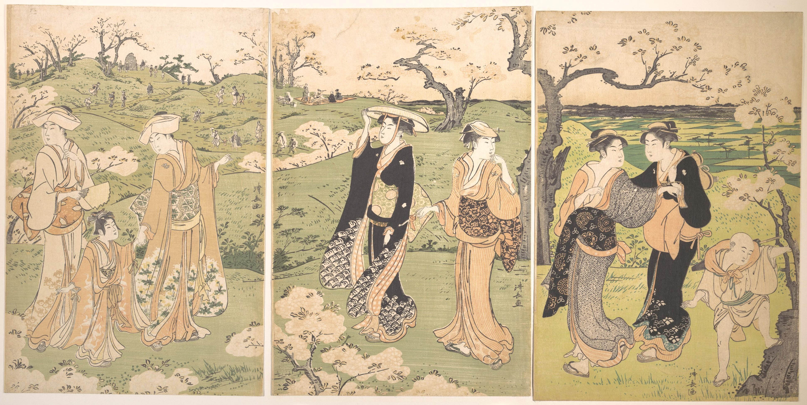

**Title**:  Tokugawa Travel: Authorities' Lenience Pilgrimage and Tourism

**Other title ideas**: 
- Understanding the rise of peasant pilgrimage: The bakufu and daimyo's lenience against an emerging tourism industry
- Understanding Edo Period Tourism: Tokugawa's lenience of peasant pilgrimage
- Tokugawa Lenience of Pilgrimage
- Lenience of the Tokugawa Bakufu Towards Tourism and Pilgrimage 

### Table of Contents
 [Abstract](#abstract)
 
 [Thesis](#thesis)
- [1. Introduction](#1-introduction)
- [2. Argument by historians](#2-argument-by-historians)
- [3. The commercialization of pilgrimage](#3-the-commercialization-of-pilgrimage)
	- [3.1 Promotion of pilgrimage for financial gain](#31-promotion-of-pilgrimage-for-financial-gain)
	- [3.2 The commodities of pilgrimage](#32-the-commodities-of-pilgrimage)
	- [3.3 The economic significance of pilgrimage](#33-the-economic-significance-of-pilgrimage)
- [4. Response of the authorities](#4-response-of-the-authorities)
	- [4.1 The Ōyama pilgrimage](#41-the-%C5%8Cyama-pilgrimage)
	- [4.2 The *nukemairi* pilgrims](#42-the-nukemairi-pilgrims)
	- [4.3 The Shikoku pilgrimage](#43-the-shikoku-pilgrimage)
	- [4.4 Non-religious tourism](#44-non-religious-tourism)
- [5. Changes in governance](#5-changes-in-governance)
	- [5.1 Tokugawa bakufu](#51-tokugawa-bakufu)
	- [5.2 The daimyo](#52-the-daimyo)
	- [5.3 The influence of merchant thought](#53-the-influence-of-merchant-thought)
- [6. Conclusion](#6-conclusion)
- [Bibliography](#bibliography)

## Abstract
(200-250 words, 日本語250‐300)

While studies of travel during the Tokugawa period reveal a flourishing tourism industry from pilgrims, many historians present the situation as the bakufu and daimyo authorities being clearly set against peasant pilgrimage and sightseeing, implementing a system of barriers and strict rules to impede their movement. Other historians refute this image of control, revealing the bakufu's laxity in allowing travel by making permits easier to obtain; however, because it is is positioned as if the bakufu wanted to curb pilgrimage but were unable to, the combined research of these historians supports the idea that the bakufu and daimyo were set against pilgrimage, particularly when it had leisurely motivations. 
Countering these claims, I argue that by understanding the economic motivations of the religiously affiliated groups who first promoted travel and how it led to the commercialization of pilgrimage, and observing the effect which those pilgrims had on the region, the social and economic benefits that the authorities could gain from tourism and pilgrimage become clear. Furthermore, research demonstrating the bakufu and daimyo's positive response and support for even problematic pilgrimage, and evidence of their direct creation and promotion of non-religious tourist destinations, reveals that the authorities had a clear interest in the flourishing of the tourism industry which came from pilgrimage. In addition, research on governance during the Edo period reveals a shift from an authoritarian position towards a benevolent ruler that sought the economic well-being of the common people. I argue, therefore, against the idea that the bakufu and daimyo authorities wished to restrict the movement of the commoners, and that the regulations they made pertaining to travel were to ensure that pilgrimage did not have a negative impact while allowing it to grow the economy.  

# Thesis
## 1. Introduction
As Japan entered an era of peace in the beginning of the Edo period, the Tokugawa bakufu took steps to ensure that the daimyo would not have the means of uprising by implementing the alternate attendance system, which required the daimyo to make regular trips to Edo every other year (Park and Tanaka 2014). In order to facilitate this compulsory travel, the bakufu developed extensive infrastructure, building a centralized road network throughout Japan. To ensure that traffic flowed smoothly, the roads were regularly cleaned, wheels that would damage the surface were banned, and trees and shrubs were planted along the side of the road to provide shade and wind cover (Vaporis 1994). Along the main routes, the bakufu also established post stations where businesses offered lodging, food, and travel services, and while they had to prioritize servicing Tokugawa officials and daimyo, these services were allowed to cater to the lower classes. In order to monitor this movement throughout the regions, the bakufu positioned barrier stations along the road, the passage through which required a permit. While permits of a leisurely nature for pleasure were not issued, a journey for the purpose of pilgrimage or visiting an onsen for health reasons were viewed by the authorities as valid reasons for travel (Ando 2021; Goree 2020). 

At the same time that the conditions for travel were greatly improved, the lower classes of peasants and merchants began to find themselves with increasing financial freedom, which made travel more viable (Ishimori 1989). As advances in media captured the appeal of travel, with many guidebooks on famous sights and attractions being published, pilgrimage became increasingly popular (Fabricand-Person 2011). Over time, sightseeing and enjoying local specialties became common elements of the journey, sometimes even turning into the primary focus of the pilgrimage itself (Nenzi 2004). Thus, the commoner was able to take advantage of the travel infrastructure laid out by the Tokugawa bakufu and out of their pilgrimage soon arose a booming tourist industry.

Despite the evident popularity of pilgrimage and sightseeing, many historians have argued that the bakufu and daimyo authorities were positioned against the pilgrimage of commoners, claiming that since it had a negative economical impact and anti-structural elements, it was seen by the bakufu as subversive and therefore posed a threat to their authority (Blacker 1984; Traganou 2004). Therefore they sought to "discourage recreation, inessential travel, and other 'unproductive' uses of time" (Totman 2005, 265). The motivations of the authorities remains open to debate, however, as their lenience towards pilgrimage is revealed in studies by Vaporis (1994, 2012). In his research on travel infrastructure and the permit system, which made significant contributions to the study of Edo period travel in English, he overturns previous assumptions of the bakufu's nature of being authoritarian, intrusive, and closely regulating all aspects of society. Vaporis observes that the checkpoint officials dealt with travelling peasants with an increasing measure of laxity, in contrast to the strictness they showed samurai and the upper classes. In fact, he argues, the changes that the bakufu made to the permit system made pilgrimage applications more flexible and easily obtained by peasants, a change that appears to be done in order to encourage travelers to apply for permits instead of leaving without permission. Vaporis concludes that while the bakufu made certain restrictions of travel, the peasants found ways to circumvent these barriers and thus were not immobile. Although his argument challenges the fact that the authorities fully controlled the peasants' movements, he positions this is if it is despite the intent or against the desire of the authorities, claiming that the daimyo and bakufu idealized the population being tied to the land. The combined research from these historians, therefore, results in an image of the authorities being against pilgrimage and leisurely travel, and trying, however unsuccessfully, to curb its practice.

This paper presents an alternative perspective; because the market economy was of great importance to the bakufu and daimyo, as my previous research (N. Hall 2022) revealed in their efforts to manage the rice market and increase agricultural yields, the economic benefits to be gained from pilgrimage is highly relevant to understanding the intent behind their regulations towards it. Furthermore, this lenience toward commoner pilgrims and acceptance of the tourism industry from pilgrimage was because the trend in governance of the Edo period was not authoritarian, but socially responsive (Paramore 2012) and ruling with a measure of benevolence (J. Hall 1966). This approach stemmed from the structural changes that occurred when the Tokugawa regime came to power, as they adopted Confucianism's ethics of benevolent rule in order to justify their position as shogunate. As these changes destabilized the position of the daimyo, it in turn affected how they governed their realm (Roberts 1998). From this shift towards the bakufu and daimyo seeking the well-being of the people and keeping a prosperous economy, it is understandable that they would be not only approving of the rise of the tourism industry from pilgrimage but see their own benefit in its promotion.  

In order to make the connection between the authorities' lenience and their economic priorities, understanding the situation surrounding pilgrimage is necessary. Beginning with a review of the arguments made by historians regarding the bakufu and daimyo's perspective of pilgrimage, first an examination of how pilgrimage turned into consumerist tourism. This research reveals that the religious institutions looked to pilgrims for financial support, and their promotion of pilgrimage to religious sites led to the surrounding regions competing for the business of pilgrims, resulting in tourism becoming an important industry. Next, analyzing the authorities' response to this industry reveals their underlying objective of keeping pilgrimage from harming the region and surrounding communities, while at the same time ensuring that business could sufficiently profit from it. In addition, evidence of the authorities' direct creation and promotion of tourist destinations is presented, revealing their clear desire to grow the tourism industry. Finally, from these observations I argue that the reason for such a position where the economy is the primary concern lies in the style of ethical governance that slowly began to dominate the Tokugawa period. Looking at the trend of ruling with benevolence, which became the common style of daimyo rule as they used it to stabilize their now precarious position, and how economic thought from the lower classes began to influence the daimyo, I argue that the response of the authorities toward pilgrimage was not a position against it, but keeping it within reasonable boundaries while allowing it to grow the economy. This is because the economic growth of the region was in the ruler's best interest, both financially and politically; therefore, the lenience towards the pilgrimage of the lower classes by the bakufu and the daimyo was the result of their being primarily concerned with the economy and their recognition that pilgrimage could further the prosperity of their region.
## 2. Argument by historians
In much of the literature on travel during the Edo period there is an overall perception that the bakufu and daimyo held a position against pilgrimage, wishing to restrict unnecessary movement of the peasants (Kanzaki 1995; Vaporis 2012; Watkins 2008). They claim the authorities did not recognize the concept of leisure and sought to "discourage recreation, inessential travel, and other 'unproductive' uses of time" (Totman 2005, 265). While many of the historians that present this perspective do not elucidate on why the authorities would be adverse to this travel, a few have stated that the bakufu perceived pilgrimage to be a threat due to its negative social aspects. 

For example, Traganou (2004) claims that pilgrimage meant abandoning one's occupation and was used as an escape from the restrictions Edo period society. Similarly, Blacker argues that undertaking such travel meant that farmers were neglecting their proper duty, thus the daimyo viewed pilgrimage as "frivolous, useless, extravagant and immoral" (1984, 604). Though Blacker does admit that some daimyo did not object to pilgrimages which were undertaken during the idle part of the year, she nevertheless claims that the authorities saw this traveler as playing no useful part in human society and a threat to order and stability. Perhaps this is due to Blacker's view of the pilgrim, an image of a wandering mendicant who wishes to escape from the rules of society, and one which places considerable weight on only a single pilgrim architype despite there being many reasons and situations surrounding pilgrimage (Ambros 2008). This antisocial element that both Traganou and Blacker claim to be the root of the authorities' opposition is therefore not necessarily an element of all pilgrimage. 

Other arguments that explain the authorities' position against pilgrimage point to the negative economical factors that such travel brought, such as the loss of domain financial resources. Vaporis (1994) explains how travelling into other regions meant that money would be leaving the domain, which caused concern for the ruler. Vaporis points to the example of the Kaga domain restricting pilgrimage to a popular Kyoto shrine, claiming it was to "stem the outflow of precious domain resources like gold and silver" (ibid, 202). Another negative economic factor that has been referenced is that pilgrimage could interfere with the farmer's agricultural production, to which both the bakufu and daimyo's finances were directly tied (Traganou 2004). In addition, some pilgrimages upset the local economies, "causing inflation of the prices of rice, straw, lodgings and other necessities" (ibid, 72). In contrast to this, however, is the argument that popular pilgrim destinations often develop the infrastructures needed to deal with the influx of pilgrims as commercialism becomes a part of pilgrimage, as there are clearly cases of positive effects on the community (Ambros 2008). Nevertheless, the above arguments show that in pilgrimage there exists negative economic elements and at least some pilgrims gave the authorities cause for concern. 

When looking in more detail at the legislation towards pilgrimage, however, a hard position of the authorities against pilgrimage becomes more difficult to ascertain. This is because the legislation "appears to have been merely a reaction to the social reality that existed and thus, in a sense, was little more than sumptuary legislation" (Vaporis 1994, 12). In Vaporis' study of the road barriers and travel permit system, he challenges the idea that the authorities fully controlled the movements of the lower classes, arguing that the commoners found ways to circumvent the barriers. He claims that this reality reflects the authorities' tolerance of travel and the flexibility of the system they implemented, describing the many cases of laxity where checkpoint officials allowed passage for commoners without permits or let slide permit related offenses. Quite contrary to the idea of dealing with the commoners harshly, "[o]fficials frequently bent the rules for travelers with defective permits, and sometimes downgraded travel offenses to avoid having to prosecute commoners" (ibid, 216). After his review of government policies regarding travel, Vaporis concludes that they were "on the whole, positive rather than repressive" and quite flexible (ibid, 5). He claims that "[t]his growing flexibility in a system that originally had been more rigid allowed for - and in fact promoted - the increasing mobility that characterized Tokugawa Japan from the eighteenth century on" (ibid). For this reason he warns against accepting a "legalistic interpretation of Tokugawa Japan" (ibid, 6), as doing so overestimates the state's authority and incorrectly represents the commoner as immobile, with their movements severely regulated and strictly inspected at barriers. His conclusion is that the road barrier stations did not significantly impede these travelers, despite the intention of the authorities. He further observes that "regulations dealing with commoner travel were issued frequently and were inspired mainly by economics rather than a desire for totalitarian control" (ibid, 198). 

While Vaporis' research is noteworthy and presents significant findings, the question of why the authorities were so lax in allowing pilgrimage is one that he does not directly ask, as Nosco (1996) has noted in his review of Vaporis' work. The arguments that touches upon the *intent* of the bakufu comes much in line with Blacker and Traganou, as Vaporis claims how the bakufu and daimyo envisioned the peasants being tied to the land. Overall the image he presents shows the bakufu as if they are positioned against pilgrimage, not recognizing the concept of tourism and discouraging recreational and touristic travel but unable to stop it, as if they are showing leniency because it is a fight that they cannot win. He concludes that the "regulations, while not without some effect, were not able to stem the irrepressible desire of the masses in Tokugawa Japan to travel" (1994, 198). 

In carefully examining these examples of actions against pilgrimage or discouraging tourism as presented by Vaporis and other historians, they appear to be to limit that travel's negative economic effects. The question is, did this come from a opposition to pilgrimage and tourism in itself. A possibility is that allowing commoners to acquire permits more easily is a result of the underlying motivation to stem only a certain pilgrimage that could harm a region's economy, while promoting pilgrimage that could positively increase that economy. Indeed, Vaporis even observes some domains regulating pilgrimage by having specific economic qualifications required in order to obtain a travel permits, such as "determining when and where travel was allowed, determining who was allowed to travel, and establishing the length of time as well as the number of times a person could travel" (ibid, 198). While he positions this as if it reflects the authorities' position against all pilgrimage in general, perhaps it instead shows their acceptance of it as they try to keep it within reasonable bounds. Despite his and the other arguments above that focus on the negative repercussions of some pilgrims, I argue that pilgrimage overall had a positive economic impact due to the tourism that came from it, an industry which became important for many regions of Japan. In order to see these effects in perspective, a review of what research has revealed about the factors that led to pilgrimage travel being commercialized and giving rise to tourism is necessary.
## 3. The commercialization of pilgrimage
### 3.1 Promotion of pilgrimage for financial gain
In recent years, historians have begun to approach the topic of Edo period travel from many different angles, asking new questions about why pilgrimage became so widely practiced, and how travelers interacted with their destinations, slowly revealing that the travels of pilgrims turned into what we recognize today as contents tourism (Seaton et al. 2017). While some elements of this tourism dates back to before the Nara period, such as the buying of amulets and travel souvenirs, the commercialization of pilgrimage grew to new heights during the Edo period to "become the dominant medium through which places were experienced" (Wigen 2010, 298), leading to a common type of pilgrim that has been described as a "consumer tourist" (Nenzi 2004, 286).

Examining the factors in of how pilgrimage increased and came to be commercialized reveals the economic motivations of parties who worked to popularize it for their own financial gain. The instigators of that promotion are what have been described as the first travel agents: the temple and shrine affiliated *oshi*, who acted as "mediators between the shrine and the people" (Kanzaki 1995, 44). In the beginning of the Edo period, the religious institutions began to lose financial support from the bakufu, and in an attempt to compensate for this they worked to attract pilgrims to their shrines and temples. These *oshi* were the key players in growing the popularity of pilgrimage, as demonstrated in Ambros' research (2008) of Ōyama, a mountain shrine and temple complex located in the Kanagawa Prefecture; she argues that it was due directly to the efforts of the *oshi* that the Ōyama religious site transformed into such a major tourist destination. These *oshi* appealed to pilgrim travelers by promoting shrines and temples and then arranging for the pilgrim's accommodation, providing tour guides, and offering useful travel information  (Umesao 1995). While originally much like a missionary on behalf of their shrine or temple, over time they became more merchants than priests, each with their own territory (Kanzaki 1995). An important element of the *oshi*'s promotion was the level of hospitality and entertainment that they offered pilgrims, such as preparing luxurious silk bedding and providing extravagant banquets that made use of the local gastronomic specialties. They also presented souvenirs and gifts to the pilgrims. However, underneath this "hospitality lay a cunning business spirit. What they intended was advertisement with maximum effect" (ibid, 48). After the pilgrims returned to their village, they would talk about the luxury they enjoyed and this would lead to additional pilgrim recruitment for the *oshi*. The financial gain that came from pilgrimage was not something that was felt by shrines and temples alone, however. While talismans and religious offerings were important elements of one's pilgrimage, the commercial potential of this travel was much larger. 

### 3.2 The commodities of pilgrimage
An example of pilgrimage's commercial potential is *meibutsu*, which became an important element for travelers, with locations advertising their local specialty cuisine as a marketing strategy in order to promote their popularity. Nenzi (2004) observes that the creation of many popular travel destinations was owed specifically to the presence of a *meibutsu*. "Gastronomies and knickknacks provided a convenient way to forge a link with a travel destination for those who did not wish to experiment with the ethereal and often slippery pillow words of poetic travel" (Nenzi 2008, 155). While following in the footsteps of famous lyrical travelers, such as Matsuo Bashō, was becoming quite popular, no longer did formal education preclude the traveler "from symbolically 'owning' a site—all it took now was a string of coins and, sometimes, an appetite" (ibid). The consumption of these non-religious elements grew to be widely popular, and to the demand of these pilgrims the tourism industry responded with merchandise. "Tangible objects and local specialties had become the material equivalents of a quotation, the commodi­fied counterparts of an intellectual, intertextual engagement" (ibid 156). Souvenirs to bring back to the pilgrim's hometown had become an important aspect of the trip itself, as it gave validation of one's travels and offered the experience with those of the village who could not visit themselves. Similar to tourism in modern day Japan, a wide variety of industries took advantage of the link their to the region or religious site and marketed themselves as *meibutsu*. For example, the port town of Marugame in north Shikoku sold many souvenirs for the nearby Konpira Shrine, a famous pilgrimage destination. Among those advertised were not only locally made fans that had a direct association with the shrine, but they found ways to link locally produced oil, miso, and medicines to the shrine's deity (Thal 2005). 

Furthermore, it was not physical products alone that took advantage of pilgrims, as teahouses and brothels sprung up alone the pilgrimage routes.  These services quickly became popular stops along one's journey (Oshida et al. 2011), with some prostitutes becoming famous *meibutsu* themselves (Nenzi 2004). The popularity of these non-religious elements was in turn taken advantage of by the religious groups, "making recreational goods and services available within or just beyond their gates" (Goree 2020, 8).  

Figure 2: Roadside tea house at Fuchu station on the Tokaido highway, selling a famous meibutsu, the Abekawa rice cake. By Andō Hiroshige.
*Source*: Wriston Art Center Galleries.

The effects of pilgrimage, therefore, were felt far beyond the industry of travel, and created a situation of competition between regional businesses and religious sites. From that competition cases of conflict did arise, something which the aforementioned historians point to when they discuss the dangers of pilgrimage; I would argue, however, that even the negative effects that pilgrimage had on a community serves to outline just how important of an industry it was becoming to the region. 
### 3.3 The economic significance of pilgrimage
The size and importance of the pilgrimage and tourism industry for some regions can be seen in Nenzi's research (2004) into the interactions of pilgrims and their destinations during the Edo period. Using as a case study the region of Sagami, located in modern day Kanagawa prefecture, Nenzi traces the many cases of conflict between regional parties who competed for profits from these pilgrims. To resolve this conflict, those parties turned to the regional governments and Edo authorities to stop practices that resulted in the decline of pilgrim visitors.

In one example from 1650, the head of a temple of the goddess Benzaiten in Enoshima complained that local fisherman were selling the deity's amulets and leading travelers to their own establishments, instead of telling them how to reach the temple's lodgings. This resulted in a loss of income for the temple, thus they petitioned the shrine and temple magistrate in Edo to put a stop to what they felt were illegitimate inns. The response from the magistrate was a compromise, allowing the private non-temple affiliated inns to be run when there was an overflow of travelers which the temple could not accommodate. As for the amulet distribution, it could continue as long as "those who benefited from it also provide services to the temple" (ibid, 306). Despite this ruling, the fishermen and other local entrepreneurs continued to target pilgrims, and over the decades tensions between them and the temple persisted. Nenzi observes the temple's efforts of commercialism in response to this, as they offered various accommodations packages and special amenities and provided elaborate meals and entertainment to guests. The attractions that drew pilgrims to this area thus developed into a commodification of local history and regional specialties, revealing a new common type of pilgrim that Nenzi calls the "consumer tourist" (ibid 286). As reflected in the woodblock print of the late eighteenth century (figure 2), pilgrims that combined religious sentiment with touristic intent became a common sight in Enoshima. "As commercialism burgeoned and the historical icons of the past became the trinkets and menu items of the present, the modalities of the interaction between visitors and sites also expanded dramatically, taking on new nuances that did not replace but complemented the old ones" (Nenzi 2008, 154). By the nineteenth century the number of pilgrims grew to the point that the temple infrastructure could not handle their accommodation, which lessened the tensions between competition. Observing how the pilgrimage scene unfolded at Enoshima reveals that it was clearly a key point in the economic growth of this region. 

Figure 2: Tourists enjoying fishing at Enoshima. By Kitagawa Utamaro.
*Source*: The Cleveland Museum of Art 

A similar trend of competing for the profits from pilgrims can also be observed in the region around the Ōyama shrine and temple complex, where in the latter part of the eighteenth-century quarrels arose over packhorse fares and lodgings of pilgrims (Nenzi 2004). By 1840 local inns and village leaders made an agreement to resolve the issues of lost profit from pilgrims by lowering ferry fares and eliminating regional tolls, which had been causing travelers to choose alternate routes. "These official ordinances and self-imposed codes of conduct intended to regulate the proliferation of traffic indicate the growing complexity of the space of travel and the increasing weight of consumer logic" (ibid, 309). The importance of this consumer logic surrounding pilgrimage is also noticed by other historians, as Ambros (2008) observes how providers of services and goods catered to the growing desires of pilgrims, which fueled the regional economy and over time many local businesses came to rely on Ōyama pilgrimage.

Similarly, in other areas of Japan religious institutions worked with the local region to promote pilgrimage. Thal's research (2005) into the Konpira religious site in Northern Shikoku, a destination which rivaled Ise in popularity, shows that the growth of this site was not due to its religious significance alone; it relied on business owners as much as it did on the priests, and the popularity of this location developed in tandem with the surrounding markets and entertainment. In order to raise income as well as the religious status of the shrine,"[t]he priests of Konpira, like priests of other would be pilgrimage sites, simultaneously developed the attractions of both the god and the town to boost the economic viability of the sacred domain" (ibid, 3), holding lavish festivals and parades which they timed with events in the nearby town. A similar phenomenon that was common to many pilgrimage sites of Japan and around the world, the Konpira religious complex "grew amid a bustling pilgrimage economy of entertainments and commerce: performances, prostitution, and gambling proved as integral to the growth of the sites as amulets and worship" (ibid, 3). 

This mixing of religious and worldly elements in turn became an opportunity for the daimyo, as reflected in how the Konpira religious group rewarded regional lords in exchange for their patronage by offering social benefits that "legitimized, protected, and enhanced" their prestige (ibid, 76). Thal describes how the support of three nearby daimyo mutually benefited all parties, "weaving the sacred domain of Konpira - oustide the formal boundaries of any of the three larger domains - into an expanding network of personal, economic, and ritual relationships" (ibid, 78). The religious popularity of the Konpira site, which was fueled by the pilgrims who traveled to it, thus came to be of importance to these daimyo, affecting their social and economic power. "The development of a widespread pilgrimage culture in the nineteenth century both relied upon and enabled the growth of economic networks of consumption, advertising, and offerings" (ibid, 98). As these networks grew, they contributed to the growth and development of the economy, society, and "a multifaceted culture in which the gods play an integral part" (ibid). 

These examples demonstrate how important the commercial elements of pilgrimage in the Edo period came to be for a region' business, its shrines and temples, and the ruling daimyo. It greatly affected the regional landscape, with existing towns flourishing, and new towns forming around popular shrines and temples, both which were due to the direct results of pilgrimage (Ishimori 1989). In turn, the popularity of a religious site could offer social benefits in exchange for the patronage of regional lords. The economic significance of pilgrimage would therefore not be dismissed by the bakufu or daimyo just because the peasant was responsible for agricultural production. Despite the idea that the authorities viewed the peasant as someone who should stay tied to their land, as argued by Vaporis, catering to these pilgrims "by providing food, lodging, and entertainment at religious sites was the foundation of much of the modern Japanese tourism industry" (Seaton et al. 2017, 20). While it is arguable that the above cases of conflict in Enoshima and Ōyama over the competition of pilgrims might reveal a neutral action of the authorities towards pilgrimage, I would argue that it shows their priority of keeping order and responding to the needs of the community. In order to asses their disposition towards pilgrimage more definitively, however, it is necessary to review other cases of their involvement with pilgrimage and its tourism, where they show both positive and negative reactions, and consider what elements might have caused such reactions.
## 4. Response of the authorities
### 4.1 The Ōyama pilgrimage
In Ambros' research (2008) of the pilgrimage to Ōyama, a religious site which over the course of the Edo period gained tremendous popularity, she argues that the reaction of the bakufu toward pilgrimage depended on how exactly that pilgrimage was conducted. In looking at the make-up of Ōyama pilgrims, for example, she observes that they were largely from confraternities, where the members "pooled their funds to finance the pilgrimage, and therefore the pilgrims were not a burden on communities along the route but fueled the regional economy" (ibid, 16). The pilgrimages also usually took place before harvest, sending only a select few members of the community and thus village life was not disrupted. In addition, these pilgrimages were not for the sake of a single individual, but undertaken on behalf of the entire community, as the pilgrims would bring back amulets for everyone. Therefore, Ambros argues, the bakufu were not against it. "The few regulations that pertained to it were not so much meant to limit the pilgrimage to Ōyama but more to ensure that pilgrims did not extend their pilgrimages unduly and maintained order on their journeys" (Ambros 2008, 173). These community-building aspects of pilgrimage have been noted by Japanese historians as well, who argue that pilgrimage reinforced social harmony and the experience from that travel was highly valued as a rite of passage, pointing out that it created solidarity among families and fellow pilgrims (Park and Tanaka 2014; Shinno 2002). 

To illustrate that the type of pilgrimage directly affected the response of the bakufu, Ambros contrasts their support of Ōyama by pointing out how the bakufu outlawed confraternities of Mt. Fuji a number of times during the eighteenth and nineteenth centuries. The reasons behind their actions have been argued to be due to how the Fuji cult was managed and how its members acted. As Tyler (1981) explains, this was a new religion without any connection to an established sect and therefore illegal by definition. In addition, the cult had troublesome practices, such as frequently refusing to provide sick pilgrims with any other medication besides the holy water from the Fuji mountain, and chanting while handing out talismans outside people's gates. Finally, because the devotees were a mingling of commoners and samurai, the bakufu were concerned with potential subversion. In other words, it was not because the bakufu sought to curb pilgrimage, but because this specific sect was seen as problematic for the region and socially disruptive. 
### 4.2 The *nukemairi* pilgrims
Another type of pilgrim that was seen as problematic was the *nukemairi*, the absconding pilgrimage taken without permission (Ambros 2008). This type of unauthorized pilgrimage was one that garnered opposition from the pilgrim's communities as well as the authorities, and was seen as selfish and an inconvenience to one's family and master. The Osaka City Magistrate thus prohibited *nukemairi* because it was threat to civil peace; pilgrims were "without discretion, simply dropping what they were doing and leaving home, neglecting to shut doors or put out fires" (Vaporis 1994, 207). There were also instances where *nukemairi* pilgrims left infants and elderly unattended, and a case of too many apprentices suddenly leaving at once and causing a labor shortage. The authorities, therefore, deemed *nukemairi* to be causing harm to the region and its economy and thus discouraged it. Perhaps this is why it is often referenced when historians (such as Blacker and Goree) comment about the authorities' strictness of pilgrimage. Indeed, Ambros points out that the *nukemairi* type of pilgrim is "partially responsible for the pervasive view of pilgrimage in the early modern period as a disorganized and even subversive activity" (Ambros 2008, 145). While there are clearly community concerns surrounding *nukemairi* pilgrims, being against it is not the same as being against pilgrimage and travel in general. While not making this statement specifically, in Vaporis's observation of the large spectrum of regulations instituted by the bakufu, he does note how they try to make applying for a permit easier in order to specifically counter *nukemairi*. For example, the changes by the Kaga domain appeared to be reactionary as they attempted to make the permit application process more simple. Vaporis reasons that "[t]his was done to encourage commoners to apply for travel permits, rather than to leave home without them" (Vaporis 1994, 173). Based on these observations, it is reasonable to argue that the intention behind the constraints that the authorities put on pilgrimage was meant to only limit a pilgrim's potential negative repercussions on their home region.
### 4.3 The Shikoku pilgrimage
While the *nukemairi* pilgrims have been argued to have been largely associated with pilgrimage to the Ise shrine, another type of traveler that similarly had a negative image was the "solitary, mendicant pilgrims"(Ambros 2008, 145), who traveled around the Shikoku circuit pilgrimage of eighty-eight religious sites, a journey that usually took a period of months. This pilgrimage was often undertaken by individuals or small groups who were not connected to religious associations or confraternities, unlike pilgrimages of Ise and Oyama who had religious institutions promoting and managing the pilgrim's travel directly. Ambros argues that this mendicancy was view by both bafuku and domainal authorities as disruptive and antisocial because they "perceived religious travel as a burden on the communities that hosted pilgrims as well as on the home communities left behind" (ibid, 146). The bakufu therefore instituted constraints to counter that burden, such as travel duration and specifying a specific route which must be taken. These constrains are often referenced by historians (such as Vaporis) as cases where the authorities were more restrictive towards pilgrims, and Blacker (1984) uses this type of pilgrim in her argument that pilgrimage was used as a way of escaping the restrictiveness of Edo society: by cutting their moral ties and putting themselves outside the vertical hierarchy, they gain the freedom much like the outcasts and divine wanderers. Traganou (2004) also argues that this liberation from social responsibilities and hierarchy that attracted pilgrims was seen by the bakufu as subversive and therefore posed a threat to their authority. It is important to realize, however, that those constraints were instituted in order to protect the region. 

While there are certainly many constraints regarding the Shikoku circuit pilgrimage, when looking at the level of freedom that the authorities were granting pilgrims, Kouamé (1997) argues that the restrictiveness of the regulations were comparatively insignificant. Furthermore, amidst the many rules and regulations was a clear tolerance to encourage a positive pilgrimage industry. Kouamé points out that while the authorities did try to closely regulate pilgrims and forbid disorderly and disruptive behavior, "they also provided a system of support for those in need who followed the regulations"(ibid, 424). For example, in the case of a pilgrim's illness or death, they could depend on local officials to provide medical care, repatriation, or burial. Looking at the number of pilgrims that the authorities helped return to their home regions was "quite significant", Kouamé argues, and "[i]t is clear that such assistance was standard practice" (ibid, 423). It is also important to note that these regulations were laid down by the Tokugawa bakufu in the seventeenth century, so while the Shikoku authorities may have just been following the rules, even so they should not be analyzed in terms of only oppressive control, because it is clear that they also helped pilgrims in trouble. 

There were, of course, punishment for violation of rules, such as denying the pilgrims entrance to a province. In one such instance in the early nineteenth century, two sick pilgrims who were undertaking the Shikoku pilgrimage in hopes of it curing their illness were denied entry into Tosa, the southern region of Shikoku. The authorities of Tosa are believed to have been the most severe towards pilgrims, but in looking closely at the situation of the region at this time, Kouamé observes that Tosa was experiencing a famine, and thus the authorities were likely trying to prevent the sick pilgrims, who they feared might stay in the province beyond their allotted time, from becoming a burden to the locals (ibid, 418). This example demonstrates that the background of the situation surrounding actions taken against pilgrims needs careful consideration, because the caution exercised by the Tosa authorities may be not a reflection of their position against pilgrimage, but against specific cases of negative regional repercussions or antisocial elements. Indeed, Kouamé argues that even in such cases where those antisocial elements existed, it appears "to have had no influence on the general attitudes of local authorities towards common pilgrims" (ibid, 419). Kouamé concludes that the case of Tosa provides "an example of the degree of tolerance seen in an administration renowned for its severity and the degree of flexibility of a social system known for its rigidity" (ibid, 414). 

Therefore, while some historians may use the Shikoku circuit pilgrimage or the *nukemairi* pilgrims as an example of the authorities' opposition of pilgrimage, upon closer examination they provide evidence of both the bakufu and the local daimyo's support of the pilgrims during their journey. As the cases above reveal, the the authorities were clearly not against all pilgrimage; how pilgrimage was conducted and how it affected the local region appears to be a deciding factor on whether the they supported or prohibited it. Furthermore, from their reaction it is evident that they prioritized keeping the economic effects of the pilgrimage industry positive. 
### 4.4 Non-religious tourism
The cases above reflect the bakufu and daimyo's reaction towards pilgrimage specifically, but if we consider the argument of the historians once more, they often mention the authorities' negative stance toward leisure and sightseeing, pointing out that this was a large reason for the position against pilgrimage, since it often had touristic elements (Blacker 1984; Traganou 2004; Vaporis 1994). This argument, however, is not convincing because there are cases where the bakufu directly promoted tourism.

An example of this can be seen in how they dealt with the media industry that promoted travel, which included guidebooks, maps, and travel dairies. If the bakufu had sought to curb commoner travel, letting information relating to it flourish seems highly counter productive, yet they did not monopolize or control spatial information and allowed free use of map images (Yonemoto 2003). Furthermore, there are occasions where the authorities had direct involvement in the dissemination of tourism information. In the latter part of the Edo period, the senior town administrator of the Kanda ward in Edo created and published a compilation of Edo guidebooks, with illustrations and descriptions covering over 1043 places of interest, a book which became highly popular (Ando 2021). 

Perhaps the most convincing evidence of the bakufu's advocacy of tourism and travel is the fact that they themselves created a purely tourist location. In Ando's research, he explains that in the early eighteenth century, Edo was still a newly emerging city and lacked historical attraction sites, but the bakufu began to utilize the natural landscape to create famous places of interest. An example is the sakura flower-viewing parks of Edo, Asukayama and the Sumida Riverbank, where the bakufu took great efforts to plant sakura trees and draw tourists with entertainment facilities. 

Figure 3: *Young ladies viewing cherry blossoms at Asukayama*, by Torii Kiyonaga. 
*Source*: The Metropolitan Museum of Art. 

The shogun Yoshimune himself even endorsed visiting Asukayama to view the sakura, a publicity stunt that Ando describes as salesmanship at its best. In fact without Yoshimune, Ando claims, this famous sightseeing spot would not have been possible. He argues that Yoshimune was responsible not only for these artificially made tourist attractions, but was also behind the creation of a *meibutsu*, the chomeiji sakura mochi, which uses sakura leaves to sandwich a sweet-bean filled rice cake and is still popular today. 

This direct creation and endorsement of tourist attractions leaves no doubt about the position of the bakufu toward leisure, and along with the aforementioned research, clearly demonstrates their acceptance of pilgrimage and tourism. The question of why, however, still remains. I argue that their underlying priority is economic prosperity, a focus which is the result of the shifting political landscape of the early Edo period to which the bakufu and daimyo adjusted their style of governance in order to retain their position and power.
## 5. Changes in governance
### 5.1 Tokugawa bakufu
The image of the Tokugawa bakufu is often portrayed as authoritarian, caring little for the welfare of the commoner and restricting both physical and financial freedom (Gordon 2005; Tragaou 2004). Contrasting this image, there are also arguments that reveal a shift to prioritize the economic prosperity of the common people as a result of a change of governance and social structure that followed Tokugawa Ieyasu's rise to shogunate, as he sought to legitimize his newfound position of power (J. Hall 1966; Roberts 1998). Among these changes is the adoption of Confucianist ideas, described by some historians as "benevolence" (J. Hall 1966). While Gordon (2003) and Tanimoto (2019) argue that the Confucian concept of benevolence was not popular in the seventeenth century, pointing out the authoritarian "squeezing of the peasants" for their own benefit, Tanimoto does at admit that there are some instances, such as civil engineering infrastructure, the economic interests of the authorities and the common people likely overlapped. However, looking deeper into the social and economical changes as Japan entered an era of peace, a more complex picture of society and the bakufu's governance arises, one that no longer fits the term feudalism (J. Hall 1966).

In the late seventeenth century as Tokugawa Ieyasu rose to power, he made many attempts to legitimize his position as shogun while destabilizing the daimyo to prevent any possible uprising. Despite his many efforts, including connecting his lineage to the imperial family and Minamoto line, his position remained politically precarious (J. Hall 1966). To compensate for this, he worked to put in his direct control the most productive lands and commercial centers in order to strengthen the Tokugawa regime's economic power. This meant control of monetary and commercial policy, and access to the largest supplies of loan capital. In addition, Tokugawa also had ownership of the largest mines of precious metals, which helped the ability to control currency. While Tokugawa's manpower may have been spread thin across all of Japan, as long as the country's economic and technological level "remained relatively unchanged, the Tokugawa [administration] could thus claim certain economic advantages which made possible their domination of national economic policy and the nationwide organs of exchange and transportation" (ibid, 358-359). This is one reason behind the bakufu's focus on the economy, and why they closely managed the rice market as revealed in N. Hall (2022). In addition to prioritizing economic power, Tokugawa also drew upon Confucian ethics and principles of social structure to justify the Tokugawa regime and its status-based legislation in the claim of benevolent governance. 

These changes that Tokugawa instituted in order to protect his hegemony, J. Hall argues, fundamentally transformed the "whole structure of society and the exercise of authority" (1966, 392); the relationships of society that had been "essentially vertical systems were being replaced by more generalized, horizontally defined, functional group relationships" (ibid). For example, in an effort to immobilize potential opposition to the Tokugawa regime, the daimyo were relocated and restructured. The bakufu also conducted regular inspections of the daimyo, checking the domain's productivity, administration methods, financial resources, and the people's standards of living. No longer was the tenure of a family always hereditary and the confiscation of a daimyo's lands or transfer to a different region, which happened frequently, were usually "for lack of heir, mismanagement, infringement of the basic regulations of the shogunate, or, of course, as a sign of favor" (ibid 362). In addition, the samurai were taken from the villages and put to live in the castle towns, which greatly weakened the daimyo's direct connection to the villages. As a consequence of these changes, "the peasantry and other classes as well came to acquire a more uniform public identity ",  and the position of the daimyo shifted from "manorial lords or patriarchal superiors" to "rulers and officials" (ibid, 392). J. Hall argues that the "Tokugawa government rested on the fundamental conception that society was composed of statuses, or estates, each with its particular function" (ibid, 369). Because these changes to social organization created the need to devise a more rational basis and ideological foundation of one's rule, both for the shogunate over the country and the daimyo over their region, the focus shifted to whether the ruler was fit to manage the subjects of the realm. J. Hall points out that "the successful daimyo after 1600 was one who learned to master the ethical-rational system of beliefs which supported his right to rule as a benevolent autocrat committed to the welfare of his subjects" (ibid, 393).
### 5.2 The daimyo
As a specific example of this type of benevolent rule, J. Hall presents the Mitsumasa daimyo of the Bizen province, observing that its government was concerned with the well-being of the lower class. J. Hall argues that the style of government of the Bizen province, which lasted for two hundred years, provides "one of the best examples of the successful daimyo of the Tokugawa age" (ibid, 403). The principles of Mitsumasa's governance lay within the Confucian principles of benevolent authoritarianism. This structure was "built upon the foundations of military organization and civil administration which had been laid by his predecessors", but Mitsumasa "went further and added to his rule the indispensable ingredient of moral rationale" (ibid, 403). In J. Hall's observation of the Bizen domain, he concludes that Mitsumasa's fame was due to how he adapted the Confucian ethical ideas to his governance and "persistently sought to regulate his own conduct by them". To illustrate this, at one point after the failure of a crop brought famine, Mitsumasa admonished his subordinates for squeezing the peasants too much and sacrificing their welfare for the sake of taxes, and seeing these turn of events as a direct reflection of his own governance he quickly provided relief to the commoners who suffered. Mitsumasa focused his attention on public welfare, closely monitoring the local conditions and encouraging his housemen of the "need for discipline, loyalty, and selfless service to the people of the domain" (ibid, 406). Like this example, the power of a ruler of other domains became linked directly to the condition of the population within their realm and became closely connected to the economic potential they held. 

This shift towards a socially responsive government is also recognized by Paramore (2012) in his research on the state academy and its examination system in the later half of the Tokugawa period. Refuting the arguments that Neo-Confucian political concepts encouraged authoritarianism, Paramore argues that governmental changes were usually designed to open up the decision making process to more people, and can be seen as "an attempt to generate more socially engaged, inclusive, and responsive governance" (ibid, 27). This argument runs contrary to the idea that the Tokugawa government was top-down and authoritarian. While Paramore's research looks at the later half of the Tokugawa period, there are concrete examples of bottom-up governance from the seventeenth century as mercantilism began to influence the ruler's perspective. 
### 5.3 The influence of merchant thought
In Roberts' research (1998) on the merchant origins of nationalism during the Edo period, he observes that one way the government incorporated new ideas and policies into their administration was the use of petition boxes. "Petitioning in all forms was a major means of integrating the interests of the ruled and the rulers" (ibid, 132), by providing opinions outside of the governmental hierarchy while leaving the ultimate decision with the rulers. These petition boxes were used by many of the domains, including the bakufu, and Roberts believes that their prevalence suggests a search for new ideas. From the incorporation of suggestions from the commoner, the mercantilist thought of *kokueki*, meaning "prosperity of the country", became embedded into the discourse of the samurai and ultimately they adopted the *kokueki* thought into their perspective (ibid, 133).

As an example of this thought, among petitions where the term *kokueki* appears are calls for encouraging tourism. Among these is one from a scabbard maker, Zenpachi of the region of Tosa, who suggests, among other things, that the daimyo promote pilgrimage to a famous local temple. Zenpachi argues that if access into the region was made easier, that pilgrims would increase, and 'every year great amounts of foreign gold and silver would drop into the country, working eternally for the prosperity of the country and providing all of the people with a living'" (ibid, 142)." Roberts points out that an important part of this petition is that in Zenpachi's many suggestions, none of them represent his personal economic interest and represents "a way of understanding the economy and the lord's and people's roles within it" (ibid). This was inspired, Roberts argues, by the idea of *kokueki*. "It is not inevitable that a scabbard maker should be so concerned with" ways for Tosa to increase profits from foreign sources, but a common element of this and other petitions "was a vision of Tosa as a single economic unit, the welfare of which was dependent mainly upon commercial concerns - most often export industries - and cash flow within the domain" (ibid, 142).
  
In Robert's observation of these petitions, he notes that not all of them were enacted and often there was disagreement among townspeople on what should be suggested, therefore the interest of the samurai "in the economic potential of commerce and commercially inspired industry was mixed" (ibid ,149). Nevertheless, Roberts argues, in the eighteenth century this mercantilist thought of *kokueki* influenced the daimyo as they sought to reduce the the dominance of the economy of the Tokugawa shogunate. These changes reflect how widespread the rhetoric of the merchants was becoming in Edo period Japan, but also reveals that the rulers were interested in hearing input from the lower classes. Furthermore, the direct encouragement of travel and tourism that is revealed in those petitions is also clearly displayed in the actions of the bakufu in their creating tourist sites, as discussed in the above sections. Whether or not the bakufu were influenced from similar petitions or whether they realized the benefits of tourism on their own, their ultimate objective appears to be similar to that of the Tosa scabbard maker: grow the economy and prosper the region.
## 6. Conclusion
By exploring the political and socioeconomic dimensions of pilgrimage, it is evident that the bakufu and daimyo authorities were not simply opposed to pilgrimage or the touristic elements that arose from it. In observing how the they dealt with travelers of a variety of pilgrimages, including those of a more problematic nature whose pilgrims which have been argued to be potentially subversive and antisocial (Blacker 1984; Traganou 2004), it is apparent that the constraints on pilgrimage were aimed at keeping it from adversely affecting the region while offering support to pilgrims in need (Kouamé 1997). Furthermore, by examining how pilgrimage developed into a consumerist tourism industry, the economic value of these travelers becomes evident. As the research of Ambros, Kanzaki, and Thal demonstrates, the tourism industry that emerged from pilgrimage came to be important for both local businesses, religious institutions, and the region's rulers. Observing how those authorities responded to this industry reveals their efforts to support pilgrim travelers, and even the cases where they attempt to restrict pilgrimage, it appears to be for the purpose of limiting the negative effects of pilgrimage, not to curb its overall practice. Furthermore, the fact that the bakufu directly created and promoted tourist and leisure destinations clearly reflects their concern with the economy and interest in the tourism industry.

Finally, I argue that the reason why the Tokugawa authorities were primarily concerned with the economy was due to their style of governance, which used Confucian ideals of benevolent rule and economic prosperity of the people in order to legitimize and strengthen the ruler's position and power. This argument is supported by research that reveals the bottom-up style of governance that looks more democratic than authoritarian (Paramore 2012), and research that shows benevolent ruling was becoming more common and linked to a region's prosperity (J. Hall 1966; Roberts 1998). While J. Hall's research might argue that the basis for this style of governance was largely based in Confucianism, another possibility is that it simply was more economically rewarding for the rulers. As my previous research (N. Hall 2022) on the rice tax revealed, the bakufu saw it in their own wellbeing to leave the peasants with a surplus, because it led to an overall increase in agricultural production and other commodities; I believe this to be evidence of their underlying economic motivations and how they governed with a degree of what is can be observed as benevolence. Much like their actions regarding the rice tax, if the pilgrimage of the peasants had a positive economic impact, and as long as that travel did not hinder the crop yields, both the bakufu and regional daimyo would be inclined to allow it, making rules to keep it within the confines that prevented economic harm to the region. Such a position would be more beneficial than micromanaging the travel of the lower class. Indeed, the constraints that they did institute towards pilgrimage appear to be an attempt to make the system more suitable in response to the needs of the people, instead of trying to control what the people needed. 

From the findings of this research, I argue that the economic potential of pilgrimage, which was exploited by the religiously affiliated *oshi*, popularized by media and enhanced by the competition of regional businesses, was a potential that was also understood by the bakufu and daimyo rulers. Thus, that economic potential became a determining factor in how they responded to pilgrimage, and the tourism industry that grew from this travel came to be of great important to the common people as well as their rulers in order to further the region's economic prosperity. 

While Japanese historians are becoming more aware of these elements surrounding travel in the Edo period, literature in the English language is still largely limited. This research is important in order to reveal the underlying motivations behind the actions of the bakufu and daimyo authorities in how they dealt with the lower classes, and emphasizes the economic value of pilgrimage as essential to understanding why travel became so prevalent among the populace in Edo period Japan. 

## Bibliography
Ando Hiroshige (Japanese painter and printmaker, 1797-1858). _Roadside Tea House at Fuchu Station_. c. 1852. Color woodcut. Wriston Art Center Galleries, Lawrence University. [https://www.jstor.org/stable/community.15083484](https://www.jstor.org/stable/community.15083484)

Ando Yuichiro. 2021. _Edo no ryokō no urajijyō: daimyō shōgun shyomin sorezore no otanoshimi_ (The inside facts of travel in Edo: the enjoyment of the feudal lords, shoguns and commoners). Tokyo: Asahi shimbun shuppan.

Ambros, Barbara. 2008. _Emplacing a Pilgrimage: The Ōyama Cult and Regional Religion in Early Modern Japan_. 1st ed. Vol. 297. Cambridge: Harvard University Asia Center.

Blacker, Carmen. 1984. “The Religious Traveller in the Edo Period.” _Modern Asian Studies_ 18 (4): 593–608.

Fabricand-Person, Nicole. 2011. “The Tōkaidō Road: Journeys through Japanese Books and Prints in the Collections of Princeton University.” _The Princeton University Library Chronicle_ 73 (1): 68–99.

Gordon, Andrew. 2003. _A Modern History of Japan: From Tokugawa Times to the Present_. Oxford: Oxford University Press.

Goree, Robert. 2020. “The Culture of Travel in Edo-Period Japan.” In _Oxford Research Encyclopedia of Asian History_.

Hall, John Whitney. 1966. _Government and Local Power in Japan, 500 to 1700: A Study Based on Bizen Province_. Princeton: Princeton University Press.

Hall, Naiya. 2022. “Why the Tokugawa Shogunate Did Not Optimize the Land Tax.” Essay, Hokkaido University.

Ishimori Shuzo. 1989. “Popularization and Commercialization of Tourism in Early Modern Japan.” _Senri Ethnological Studies_ 26 (December): 179–94.

Kanzaki, Noritake. 1995. “A Comparative Analysis of the Tourist Industry.” _Senri Ethnological Studies_ 38: 39–49.

Kitagawa Utamaro (Japanese, c. 1754–1806). *Enoshima iwaya no tsuri asobi* (Fishing at Iwaya on Enoshima). c. 1790. Triptych of color woodblock prints. The Cleveland Museum of Art. [https://www.jstor.org/stable/community.24570699](https://www.jstor.org/stable/community.24570699)

Kouamé, Nathalie. 1997. “Shikoku’s Local Authorities and Henro during the Golden Age of the Pilgrimage.” _Japanese Journal of Religious Studies_ 24 (November): 413–25.

Langrill, Ryan. 2012. “The Evolution of Merchant Moral Thought in Tokugawa Japan.” _Journal of Philosophical Economics_ Volume V Issue 2 (Articles).

Nakai, Kate Wildman. 1988. _Shogunal Politics: Arai Hakuseki and the Premises of Tokugawa Rule_. 1st ed. Vol. 134. Cambridge: Harvard University Asia Center.

Nenzi, Laura. 2004. “Cultured Travelers and Consumer Tourists in Edo-Period Sagami.” _Monumenta Nipponica_ 59 (3): 285–319.

———. 2008. _Excursions in Identity: Travel and the Intersection of Place, Gender, and Status in Edo Japan_. Honolulu: University of Hawai’i Press.

Nosco, Peter. 1996. Review of _Review of Breaking Barriers: Travel and the State in Early Modern Japan_, by Constantine Nomikos Vaporis. _The American Historical Review_ 101 (4): 1259–60.

Oshida Keiko, Yokouchi Norihisa, Okada Tomohide, and Sebata Takahiro. 2011. “Kikōbun yori toraeta kindai kamakura ni okeru kankō keiro oyobi taizai kyoten no seiritsu katei ni kansuru kenkyū” (A Study on the Formation Process of Sightseeing Routes and Staying Points in Early Modern Kamakura, Based on Travelogues). _Randosukepu kenkyu_ (Landscape Research). 74 (5): 431–36.

Paramore, Kiri. 2012. “The Nationalization of Confucianism: Academism, Examinations, and Bureaucratic Governance in the Late Tokugawa State.” _The Journal of Japanese Studies_ 38 (1): 25–53.

Park Jin-Han, and Tanaka Toshimitsu. 2014. “Edo jidai no jyosonomin no yoka to ryoko (The Study on leisure and travelling of the upper classes of peasant in Early Mordern Japan)”. *Koku bungaku kenkyu shiryokan kiyo*, no. 10 (March): 155–74.

Roberts, Luke S. 1998. _Mercantilism in a Japanese Domain: The Merchant Origins of Economic Nationalism in 18th-Century Tosa_. Cambridge: Cambridge University Press.

Seaton, Philip A., Takayoshi Yamamura, Akiko Sugawa-Shimada, and Kyungjae Jang. 2017. _Contents Tourism in Japan: Pilgrimages to “Sacred Sites” of Popular Culture_. New York: Cambria Press.

Sheldon, Charles D. 1971. “‘Pre-Modern’ Merchants and Modernization in Japan.” _Modern Asian Studies_ 5 (3): 193–206.

Shinno, Toshikazu. 2002. “Tabi, jyunrei, yusan: kinsei sankei jijyo (eiyaku ban)” (Travel, Pilgrimage, and Pleasure Ride: Pilgrimage Circumstances in Early Modern Japan, (English translation)). Translated by Laura Nenzi. _Monumenta Nipponica : Studies on Japanese Culture Past and Present_ 57 (4): 447–71.

Tanimoto, Masayuki. 2019. “From ‘Feudal’ Lords to Local Notables: The Role of Regional Society in Public Goods Provision from Early Modern to Modern Japan.” In _Public Goods Provision in the Early Modern Economy_, edited by Masayuki Tanimoto and R. Bin Wong, 1st ed., 17–37. Comparative Perspectives from Japan, China, and Europe. Oakland: University of California Press.

Thal, Sarah. 2005. _Rearranging the Landscape of the Gods: The Politics of a Pilgrimage Site in Japan, 1573-1912_. Studies of the Weatherhead East Asian Institute, Columbia University. Chicago: University of Chicago Press.

Torii Kiyonaga (Japanese, 1752–1815). _Young Ladies Viewing Cherry–Blossoms at Asukayama_. n.d. Triptych of woodblock prints; ink and color on paper. The Metropolitan Museum of Art. [https://www.jstor.org/stable/community.18690117](https://www.jstor.org/stable/community.18690117)

Totman, Conrad. 2005. _A History of Japan_. 2nd ed. The Blackwell History of the World. Malden, Mass: Blackwell Pub.

Traganou, Jilly. 2004. _The Tôkaidô Road: Travelling and Representation in Edo and Meiji Japan_. London: Routledge.

Tyler, Royall. 1981. “A Glimpse of Mt. Fuji in Legend and Cult.” _The Journal of the Association of Teachers of Japanese_ 16 (2): 140–65.

Vaporis, Constantine N. 1994. _Breaking Barriers: Travel and the State in Early Modern Japan_. 1st ed. Vol. 163. Cambridge: Harvard University Asia Center.

———. 1995. “The Early Modern Origins of Japanese Tourism.” _Senri Ethnological Studies_ 38: 25–38.

———. 2012. “Linking the Realm: The Gokaidô Highway Network in Early Modern Japan (1603–1868).” In _Highways, Byways, and Road Systems in the Pre-Modern World_, 90–105. Chichester: John Wiley & Sons, Ltd.

Watkins, Leah. 2008. “Japanese Travel Culture: An Investigation of the Links between Early Japanese Pilgrimage and Modern Japanese Travel Behaviour.” _New Zealand Journal of Asian Studies_ 10 (2): 93–110.

Wigen, Kären. 2010. “Excursions in Identity Travel and the Intersection of Place, Gender, and Status in Edo Japan.” _Harvard Journal of Asiatic Studies_ 70 (1): 295–303.

Umesao Tadao. 1995. “Keynote Address : Tourism as a Phenomenon of Civilization.” _Senri Ethnological Studies_ 38 (February): 1–9.

Yonemoto, Marcia. 2003. _Mapping Early Modern Japan: Space, Place, and Culture in the Tokugawa Period, 1603-1868_. 1st ed. Berkeley: University of California Press.

