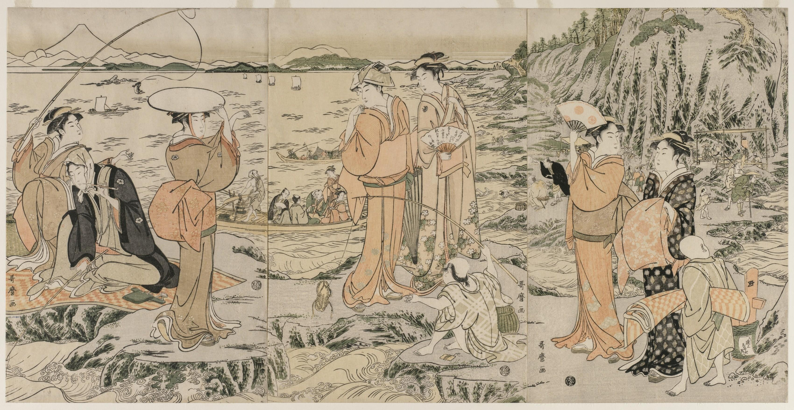

この卒論は自動的に日本語翻訳されたものですので、読みにくいかも知れません。お許して下さい。 
英語はこちら：[Graduation Thesis](Thesis.md)  
 
[ホームページに戻る](https://hall-n.github.io/)

# 江戸時代の旅行に対する当局の立場

## 要旨
江戸時代の研究では、寺社参詣から生まれた観光産業が盛んであったとされているが、幕府や大名は奢侈や遊興を厳しく制限し、庶民の旅行に明確に反対していたと歴史家は主張している。本稿は、当局の立場を明らかにする。参詣がどのように商業化され、その産業が地域にどのような影響をされたかを見ることで、旅行からの経済的利益が明確になる。そして、これに対する当局の対応と政策を見ると、参詣者への支援や観光地の造成があり、庶民の経済的な幸福を追求する立場へ移行した事が分かる。従って、当局が参詣による観光産業の繁栄に明確な関心を持っており、その旅行が地域に悪影響を及ぼさない為だけに、旅行に制限を設けたと私は主張する。

 

## 目次
1. [はじめ](#%E3%81%AF%E3%81%98%E3%82%81)  
2. [歴史学者による議論](#2-%E6%AD%B4%E5%8F%B2%E5%AD%A6%E8%80%85%E3%81%AB%E3%82%88%E3%82%8B%E8%AD%B0%E8%AB%96)  
3. [寺社参詣の商業化](#3-%E5%AF%BA%E7%A4%BE%E5%8F%82%E8%A9%A3%E3%81%AE%E5%95%86%E6%A5%AD%E5%8C%96)  
	 &emsp;　3.1 [御師による観光産業の振興](#31-%E5%BE%A1%E5%B8%AB%E3%81%AB%E3%82%88%E3%82%8B%E8%A6%B3%E5%85%89%E7%94%A3%E6%A5%AD%E3%81%AE%E6%8C%AF%E8%88%88)  
	 &emsp;　3.2[拡大する参詣商品](#32-%E6%8B%A1%E5%A4%A7%E3%81%99%E3%82%8B%E5%8F%82%E8%A9%A3%E5%95%86%E5%93%81)  
	 &emsp;　3.3[観光の重要性](#33-%E8%A6%B3%E5%85%89%E3%81%AE%E9%87%8D%E8%A6%81%E6%80%A7)  
4. [当局の対応](#4-%E5%BD%93%E5%B1%80%E3%81%AE%E5%AF%BE%E5%BF%9C)  
	 &emsp;　4.1[通行手形制度](#41-%E9%80%9A%E8%A1%8C%E6%89%8B%E5%BD%A2%E5%88%B6%E5%BA%A6)  
	 &emsp;　4.2[大山参詣](#42-%E5%A4%A7%E5%B1%B1%E5%8F%82%E8%A9%A3)  
	 &emsp;　4.3[抜け参り巡礼者](#43-%E6%8A%9C%E3%81%91%E5%8F%82%E3%82%8A%E5%B7%A1%E7%A4%BC%E8%80%85)  
	 &emsp;　4.4[四国遍路](#44-%E5%9B%9B%E5%9B%BD%E9%81%8D%E8%B7%AF)  
	 &emsp;　4.5[非宗教的観光](#45-%E9%9D%9E%E5%AE%97%E6%95%99%E7%9A%84%E8%A6%B3%E5%85%89)  
5. [統治の変遷](#5-%E7%B5%B1%E6%B2%BB%E3%81%AE%E5%A4%89%E9%81%B7)  
	 &emsp;　5.1[徳川幕府](#51-%E5%BE%B3%E5%B7%9D%E5%B9%95%E5%BA%9C)  
	 &emsp;　5.2[大名](#52-%E5%A4%A7%E5%90%8D)  
	 &emsp;　5.3[商人思想の影響](#53-%E5%95%86%E4%BA%BA%E6%80%9D%E6%83%B3%E3%81%AE%E5%BD%B1%E9%9F%BF)  
 6. &emsp;[結論](#6-%E7%B5%90%E8%AB%96)  
 [参考文献](#%E5%8F%82%E8%80%83%E6%96%87%E7%8C%AE) 
## 1. はじめ
江戸時代の初め、日本が平和な時代に入ると、徳川幕府は、大名が蜂起する手段を持たないようにするため、大名が1年おきに定期的に江戸に出向くことを義務づける参勤交代制度を導入した（Park and Tanaka 2014）。この強制的な移動を容易にするため、幕府は大規模なインフラを整備し、日本全国に集中的な道路網を構築した。交通を円滑にするため、道路は定期的に清掃され、路面を傷つける車輪は禁止され、日陰と風よけのために道路脇には樹木や低木が植えられた（Vaporis 1994）。主要なルート沿いには宿場が設けられ、旅行サービスや宿泊、食事を提供する事業が行われた。宿場は徳川役人や大名へのサービスを優先しなければならなかったが、下層階級へのサービスも認められていた。幕府は、こうした地方の移動を監視するため、街道沿いに関所を置き、通行には許可が必要だった。純粋なレジャー目的の移動は公的に認められていなかったが、寺社参詣や健康上の理由による温泉への入浴は許可されていた（安藤2021; Goree 2020）。

旅の状況が大きく改善されると同時に、農民や商人たちは経済的な自由を得るようになり、旅がより現実的なものとなった（石森1989）。メディアの進歩が旅の魅力を捉え、有名な観光名所を紹介するガイドブックが数多く出版されるようになると、寺社参詣の人気はますます高まっていった（Fabricand-Person 2011）。やがて、観光やその土地の名物を楽しむことが旅の一般的な要素となり、時には参詣そのものが主な目的となることさえあった（Nenzi 2004; 山本 1985）。やがて街道は、人気のある神社や寺院を目指す参詣者、温泉に向かう旅人、商売を営む商人、運搬労働者、施しを受けながら旅をする貧しい人々で埋め尽くされるようになった（Vaporis 2012）。

旅行が社会のあらゆる階層でいかに普及していたかは、来日したヨーロッパ人が指摘している。例えば、17世紀後半に日本を旅したドイツの医師で探検家のエンゲルベルト・ケンペルは、「この国の人は非常に旅好きである。東海道は往来が激しく、ヨーロッパの裏町のような混雑した状態だ」と主張した（Kaempfer et al. 1906）。

参詣や旅行の人気は明らかであったにもかかわらず、一部の歴史家（Blacker 1984; Kanzaki 1995; Traganou 2004）は、幕府や大名当局は農民の参詣や観光に明確に反対していたとし、幕府は「娯楽や不要不急の旅行など『非生産的』な時間の使い方を阻止しようとした」（Totman 2005, 265）と論じている。しかし、ヴァポリス（1994年、2012年）による旅行インフラと許可制度に関する研究は、権威主義的で押しつけがましく、社会のあらゆる側面を綿密に規制するという幕府の性質に関するこれまでの仮定を覆すものであるため、当局の動機については議論の余地が残されている。ヴァポリスは、検問所の役人が武士や上流階級に示した厳しさとは対照的に、旅する庶民にはますます寛大に対処するようになったと観察している。さらに、幕府が許可制度を変更したのは、参詣や旅行の許可をより迅速かつ簡単に取得できるようにするためであり、許可証を持たずに出発するのではなく、申請することを奨励するためであったようだ。ヴァポリスは、当局は大名の移動のために検問所を監視しながらも、旅行を希望する大勢の人々を受け入れようとしていたと結論付けている。

もし当局が庶民の参詣や旅行に反対していたのなら、なぜこのような寛大な措置がとられたのだろうか。本稿では、この疑問に対する答えが、参詣から生まれた経済的要素、すなわち観光産業にあると主張する。筆者の先行研究（N. Hall 2022）が明らかにしたように、幕府や大名にとって市場経済は米相場の運営や農業の増収のために非常に重要であり、したがって、参詣によって得られる経済的利益は、参詣に対する規制の意図を理解する上で非常に重要である。

当局の寛容さと経済優先の姿勢を結びつけるには、参詣を取り巻く状況と、なぜ参詣がこれほどまでに盛んになったのかを理解する必要がある。まず、歴史家の議論を概観し、ヴァポリスの調査結果を概説する。続いて、許可証制度と、その変更によって平民がより簡単に旅行許可証を取得できるようになった経緯について簡単に説明する。次に、参詣を推進するようになった神社や寺院の関係者を調べると、これらの宗教団体が幕府からの資金援助を補うために参詣者からの資金援助を求めた経済的動機が明らかになる。参詣者が増えるにつれて、周辺地域は参詣者の商売を奪い合うようになり、その結果、観光産業が台頭し、全国各地の地域にとって重要な産業となった。当局がこの産業にどのように対応したかを分析すると、その根底にある経済的な動機が明らかになる。つまり、当局は参詣が地域や周辺コミュニティに害を与えないように努力すると同時に、ビジネスとして十分な利益を得られるようにしたのである。加えて、幕府が観光地を直接創造し、宣伝していた証拠が示され、観光産業を成長させたいという明確な願望が明らかになった。最後に、幕府や大名が下層民の参詣に寛容であったのは、経済的な問題を第一に考え、参詣が地域の繁栄につながることを認識していたからであることを論じる。
## 2. 歴史学者による議論
幕府や大名が参詣や旅行に反対していたという説を紹介している文献の多くは、そのことに軽く触れるだけで、なぜ幕府や大名が参詣や旅行を嫌ったのかについては明らかにしていない。しかし、反構造的な要素から幕府が参詣を脅威と捉えていたと具体的に述べているものも少なくない。例えば、トラガノー（2004）は、参詣は職業を捨てることを意味し、江戸時代の社会の制約から逃れるための手段であったと主張している。ブラッカー（1984）も同様に、参詣や旅行は農民の義務を怠る行為であり、大名は「軽薄、無益、贅沢、不道徳」（同書、604）と考えていたようである。ブラッカーは、参詣や旅行が一年のうちで最も暇な時期に行われることに異議を唱えなかった大名がいたことは認めているが、それにもかかわらず、参詣や旅行を人間社会にとって何の役にも立たないもの、秩序や安定を脅かすものと見なしていたと主張している。しかし、この主張は、ブラッカー自身が参詣者をどのように見ているかに起因している。ブラッカーは、参詣者を社会のルールから逃れようとする放浪の托鉢僧として描いている。しかし、このイメージは、参詣や旅行をめぐる様々な理由や状況があるにもかかわらず、単一の参詣者像に重きを置いている（Ambros 2008）。トラガノーやブラッカーが当局の反発の根底にあると主張するこの反社会的な要素は、必ずしもすべての参詣に共通するものではないだろう。

また、旅行に対する当局の反対の立場を説明する他の議論は、参詣は幕府や大名の財政に直結する農民の農業生産を妨げる可能性があるとトラガノーが主張している。さらに、参詣の中には「米、わら、宿、その他の必需品の価格の高騰を引き起こし」（Traganou 2004, 72）、地域経済を混乱させるものもあった。トラガノーは残念ながら、このようなインフレがどのようにして起こるのかについては詳しく述べていないが、アンブロスは、人気のある観光地では、商業主義が参詣の一部となるにつれて、参詣者の流入に対応するためのインフラが整備されることが多いと反論している。また、トラガノーは、参詣が経済に与えたマイナスの影響しか指摘していないが、アンブロスは、プラスの影響を与え、当局の支援を受けた事例を挙げている。

トラガノーの議論には疑問が残るが、それを裏付ける具体的な例として、旅行の経済的影響について論じたヴァポリスの研究を挙げることができる。彼は、加賀藩が京都の人気神社への参詣を制限した例を挙げ、「金や銀といった貴重な藩の資源の流出を食い止めるため」だと主張している（1994, 202）。ヴァポリスは、他地域への渡航は藩の財源を失うことにつながりかねないため、支配者にとっては有効な懸念になりうると推測している。しかし逆に、領内に人気のある寺社があれば、他地域から資源が流入してくる可能性もある。いずれにせよ、平民の参詣そのものに反対するのではなく、その旅によってもたらされる経済的な影響に反対することが決め手となるかもしれない。それでも、上記の議論から、少なくとも一部の参詣者が当局に懸念を抱いていたことは明らかである。

しかし、旅に関する法律をより詳細に見ていくと、当局の寺社参詣に対する厳しい立場を確認することは難しくなる。ヴァポリスの道路障壁と旅行許可制度に関する研究では、当局が下層階級の移動を完全に統制していたという考え方に異議を唱え、庶民は障壁を回避する方法を見つけていたと論じている。彼は、この現実は当局の旅行に対する寛容さと、当局が実施したシステムの柔軟性を反映していると主張し、検問所の職員が許可証のない平民の通行を許可したり、許可証に関連する違反を見逃したりするようないい加減なケースが数多くあったことを述べている。平民を厳しく扱うという考えとはまったく逆に、「役人は欠陥のある許可証を持つ旅行者のためにしばしば規則を曲げ、平民を起訴することを避けるために旅行犯罪を格下げすることもあった」（同書、216）。ヴァポリスは旅行に関する政府の政策を検討した結果、「全体として、抑圧的というよりはむしろ積極的」であり、かなり柔軟であったと結論付けている（同書、5）。ヴァポリスは、「元々厳格であった制度に柔軟性が増したことで、18世紀以降の徳川日本を特徴づけていた移動の増大が可能になり、事実、促進された」と主張している（同書）。なぜなら、そうすることは国家の権威を過大評価し、庶民を不動なものとして、彼らの動きを厳しく規制し、関所で厳しく検査するように誤って表現するからである。彼の結論は、関所は庶民の移動に大きな支障をきたすことはなく、その移動に対する規制は「全体主義的な統制の願望というよりは、主に経済学に触発された」（同書、198）というものである。

ヴァポリスの研究は注目に値するものであり、重要な発見を提示しているが、ノスコ (1996)がヴァポリスの研究のレビューで指摘しているように、当局がなぜこれほどまでに参詣をゆるやかなものにしたのかという疑問には直接触れていない。ヴァポリスが当局の意図について述べている数少ないコメントの中には、大名や幕府が土地と結びついた民衆を理想化していたという主張がある。これは、庶民の参詣が農業に悪影響を及ぼさないのであれば、庶民の参詣や旅行に反対していたことと同じではないかもしれないが、ヴァポリスの結論では、「規制は、一定の効果がなかったわけではないが、徳川日本の大衆の旅行への抑えがたい欲求を止めることはできなかった」(1994, 198)と述べている。

ヴァポリスの立場を確認するのは難しいかもしれないが、彼の観察によれば、旅行に対する制限は経済的な要素と関連しているようだ。問題は、これらの規制が、参詣や観光そのものへの反対から来たものなのか、ということだ。可能性として考えられるのは、地域経済に悪影響を与える可能性のある特定の旅行だけを阻止し、その一方で地域経済をプラスにする可能性のある参詣や旅行を促進しようという動機が、旅行規制の根底に反映されているということである。実際、ヴァポリスは、渡航許可証の取得に特定の経済的資格が必要とされることで、旅行を規制している地域があることを指摘している。しかし、残念ながら、彼の研究課題は当局がなぜではなく、どのように反応したかにあるため、それ以上の議論はしていない。彼をはじめとする上述の歴史家たちは、一部の参詣がもたらしたマイナスの影響に大きく注目しているが、私は、参詣に伴う観光的要素によって経済的にプラスの影響を与えた例もあると主張する。このような効果を視野に入れるためには、参詣が商業化され、観光を生み出すに至った要因について、これまでの研究で明らかになっていることを概観する必要がある。
## 3. 寺社参詣の商業化
### 3.1 御師による観光産業の振興
近年、歴史学者たちは江戸時代の旅について様々な角度からアプローチするようになり、寺社参詣がなぜこれほど広く行われるようになったのか、旅人たちは目的地とどのように関わっていたのか、といった新たな問いを投げかけ、参詣者の旅が今日のコンテンツ・ツーリズムとして認識されるものに変化していったことが徐々に明らかになってきている（Seaton et al., 2017）。 お守りや土産物の購入など、奈良時代以前にさかのぼる要素もあるが、参詣の商業化は江戸時代に新たな高みに達し、「場所を体験するための支配的な媒体となった」（Wigen 2010, 298）。その結果、「消費型観光客」（Nenzi 2004, 286）と形容される一般的な参詣者が生まれた。

寺社参詣がどのようにして増加し、商業化されるようになったのか、その要因を調べてみると、自らの経済的利益のために参詣の普及に努めた関係者の経済的動機が浮かび上がってくる。そのきっかけをつくったのが、「神社と民衆の仲立ち」（神崎1995, 44）をした寺社奉行の「御師」である。江戸時代に入ると、宗教施設は幕府からの財政的支援を受けられなくなり、それを補うために社寺への寺社参詣者の誘致に努めた。アンブロスによる神奈川県の大山に関する研究（2008年）で実証されているように、これらの御師は参詣の人気を高める重要な役割を果たした。この御師は、神社やお寺を宣伝することで参詣者にアピールし、参詣者の宿泊先を手配し、ツアーガイドを提供し、有益な旅行情報を提供した（梅棹1995）。もともとは社寺を代表して布教する布教使のようなものであったが、やがて僧侶というよりも商人的な存在となり、それぞれが独自の縄張りを持つようになった（神崎1995）。絹の豪華な寝具を用意したり、その土地の名産を生かした豪華な宴会を開いたりした。また、参詣者たちに土産物や贈り物を贈った。しかし、この「おもてなし」の裏には、狡猾な商魂が隠されていた。「この御師が意図したのは、最大限の効果をもたらす広告であった」（同書、48）。参詣者たちは村に戻ると、自分たちが享受した贅沢について語り、それがまた新たな参詣者の獲得につながったのである。しかし、寺社参詣による経済的利益は、神社や寺院だけが享受していたわけではない。お守りやお供え物も参詣の重要な要素ではあったが、参詣がもたらす商業的な可能性のほうがはるかに大きかったのである。

### 3.2 拡大する参詣商品
参詣が商業的な可能性を持つようになった一例として「名物」が挙げられる。ネンジ（2004）は、多くの人気旅行先が生まれたのは、特に名物の存在に負うところが大きいと見ている。「ガストロノミーや小物は、詩的な旅行という幽玄で、しばしば滑稽な枕詞を試したくない人々にとって、旅行先とのつながりを築く便利な方法を提供した」（Nenzi 2008, 155）。松尾芭蕉のような有名な抒情詩の旅人の足跡をたどることは、かなり人気になりつつあったが、もはや正式な教育を受けたからといって、旅人が「その土地を象徴的に『所有』することを妨げることはなかった」（同書）。こうした非宗教的要素の消費は広く人気を集めるようになり、こうした参詣者の需要に観光産業は商品で応えた。参詣者の故郷に持ち帰られる土産品は、旅の証となり、自分では訪ねることのできない村の人々にも体験を提供することで、旅そのものの重要な側面となった。

そして、現代の日本における観光業のように、地域や宗教的な場所との結びつきを利用して、様々な産業が名物として売り出された。例えば、四国北部の港町・丸亀では、参詣先として有名な金刀比羅宮への土産物を数多く販売していた。その中には、金刀比羅宮と直接関係のある地元産の扇子だけでなく、地元で生産された油、味噌、薬などを金刀比羅宮のご神体と結びつける方法もあった（Thal 2005）。さらに、参詣客に便宜を図ったのは物的な商品だけではなかった。これらは参詣の途中で立ち寄る人気スポットとなり（押田ほか 2011）、遊女の中には自ら有名な名物となる者もいた（Nenzi 2004）。このような非宗教的な要素の人気は、神社や寺院にも利用され、「娯楽的な商品やサービスを、その門の中や門のすぐ外で利用できるようにした」（Goree 2020, 8）。

図1：東海道の府中駅にある、名物「安倍川餅」を売る茶店。安藤広重作。
参考文献： ウィリストン・アート・センター・ギャラリー。

それゆえ、参詣の影響は旅行業にとどまらず、地域の企業と宗教施設との間に競争という状況を生み出した。このような競争から紛争が起こるケースもあり、前述の歴史家たちは参詣の危険性を指摘している。しかし、私は、参詣が地域社会に及ぼした悪影響でさえも、それが地域にとっていかに重要な産業になっていたかを示すものだと主張したい。
### 3.3 観光の重要性
旅行・観光産業の規模が拡大し、その重要性が増していることは、江戸時代における参詣者とその目的地との交流に関するNenziの研究（2004）からもうかがい知ることができる。現代の神奈川県に位置する相模地方を事例として、参詣者から利益を得ようと競い合う地域の関係者が対立した多くの事例を追っている。この対立を解決するために、参詣者の減少を招く慣習を止めさせるために、各当事者は地方政府や江戸当局を頼った。

1650年の例では、江ノ島の弁財天の寺の住職が、地元の漁師が弁財天のお守りを売り、旅人に寺の宿への行き方を教えず、自分たちの宿に案内していると訴えた。その結果、寺の収入が減ることになり、江戸の社寺奉行に違法な宿の取り締まりを願い出た。寺社奉行からの回答は妥協案で、寺が収容しきれないほどの旅人が押し寄せた場合、寺に属さない民間の旅館を経営することを認めた。お守りの配給については、「その恩恵にあずかる者が寺院にも公的な奉仕をする」（同書、306）限り、続けることができるというものだった。この判決にもかかわらず、漁師をはじめとする地元の事業家たちは参詣者を狙い続け、何十年もの間、彼らと寺の間には緊張関係が続いた。ネンジは、寺がさまざまな宿泊プランや特別なサービスを提供し、趣向を凝らした食事や娯楽を提供することで、これに対する商業主義の努力を観察している。こうして、参詣者をこの地に引きつけるアトラクションは、地域の歴史や特産品の商品化へと発展し、ネンジが「消費者観光客」と呼ぶ新しい一般的な参詣者の姿が明らかになった（同書、309）。18世紀末の錦絵（図2）に見られるように、江ノ島では宗教的な感情と観光的な意図が結びついた参詣の姿がよく見られるようになった。商業主義が栄え、「過去のイコンが現在の装身具やメニューになるにつれ、参詣者と遺跡の相互作用の様式も劇的に拡大し、古いものに取って代わるのではなく、それを補完するような新しいニュアンスを帯びるようになった」（Nenzi 2008, 154）。19世紀になると、参詣者の数は寺院のインフラでは収容しきれないほど増加し、競争間の緊張は緩和された。江の島における参詣の様相を観察すると、この地域の経済成長において参詣が重要な位置を占めていたことがわかる。

図2：江ノ島で釣りを楽しむ観光客。喜多川歌麿作。
参考文献：クリーブランド美術館 

このような参詣者の利益をめぐる争いは大山社寺周辺でも見られ、18世紀後半には参詣者の荷馬運賃や宿賃をめぐって争いが起こった（念子2004）。1840年までに、旅籠屋と村の指導者たちは、旅人が別のルートを選ぶ原因となっていた渡し賃の引き下げと地域の通行料の撤廃によって、参詣者からの逸失利益の問題を解決する協定を結んだ。「このような公式の条例や自主的な行動規範は、旅という空間が複雑化し、消費者の論理の比重が高まっていることを示している」（同書、309）。このような参詣をめぐる消費者論理の重要性は、他の歴史学者も指摘している。アンブロス（2008）は、サービスや商品を提供する側が、増大する参詣者の欲求に応えることで地域経済を活性化させ、やがて多くの地元企業が大山参詣に依存するようになったことを指摘している。

同様に、日本の他の地域でも宗教施設が地域と連携して参詣を促進していた。伊勢神宮に匹敵する人気を誇った四国北部の金刀比羅宮に関するタールの研究（2005年）によれば、金刀比羅宮の発展は宗教的な意義だけによるものではなく、神職と同様に事業主にも依存しており、この場所の人気は周辺の市場や娯楽と連動して発展した。神社の宗教的な地位だけでなく収入も上げるために、「金毘羅の神官は、他の参詣地の神官と同じように、神と町の両方の魅力を同時に開発し、聖地の経済性を高めた」（同書, 74）。タールは、日本や世界の多くの参詣地に共通する現象として、金毘羅の宗教的複合体は「娯楽と商業の賑やかな参詣経済の中で成長した」（同書）。

このような宗教的な要素と世俗的な要素の混合は、大名にとって好機となった。これは、金毘羅の宗教集団が、地域の大名の後援と引き換えに、彼らの威信を「正当化し、保護し、強化する」社会的利益を提供することで報いたことに反映されている（同書、76）。タールは、近隣の3つの大名の援助が相互にすべての関係者に利益をもたらし、「金毘羅という神聖な領域が、3つの大きな領地の正式な境界の外にありながら、個人的、経済的、儀礼的な関係の拡大するネットワークに織り込まれていった」と述べている（同書、78）。金刀比羅宮の宗教的な人気は、金刀比羅宮を訪れる参詣者たちによって高められ、大名たちにとって重要な意味を持つようになり、彼らの社会的・経済的権力に影響を与えた。「19世紀における広範な参詣文化の発展は、消費、宣伝、供養といった経済的ネットワークの成長に依存し、またそれを可能にした」（同書、98）。こうしたネットワークが成長するにつれ、経済、社会、そして「神々が不可欠な役割を果たす多面的な文化」の成長と発展に貢献したのである（同書）。

これらの例は、江戸時代における参詣が、地域の商工業や社寺、支配大名にとっていかに重要であったかを示している。参詣は地域の景観に大きな影響を与え、既存の町が栄えたり、人気のある神社や寺院の周辺に新しい町が形成されたりした。また、宗教的な場所の人気は、地域の領主の庇護と引き換えに利益をもたらすこともあった。したがって、農民が農業生産を担っていたからといって、幕府や大名が参詣の経済的意義を否定することはなかった。ヴァポリスが主張するように、当局が農民を土地に縛られるべき存在とみなしていたにもかかわらず、こうした参詣者に「宗教的な場所での食事や宿泊、娯楽を提供することで、近代日本の観光産業の基礎を築いた」（Seaton et al. 2017、20）。さらに、江ノ島や大山における巡礼者の競合をめぐる対立に対する当局の反応は、ビジネス・コミュニティのニーズに応えることに重点が置かれており、参詣そのものに対しては中立的であるように見える。幕府や大名の旅に対する姿勢をより明確に評価するためには、許可制度そのものや、当局が参詣やその観光に関与した他の事例をより詳細に検討する必要がある。
## 4. 当局の対応
### 4.1 通行手形制度
多くの関所を通過するためには、「手形」という許可を得て旅行していることを証明した物が必要だった。大きく分けて関所手形と往来手形の2種類があった。関所手形は江戸時代の初めから一般的に使われていたようで、特定の関所用に作られ、通過する際に旅行者が手渡すものだった。この手形は幕府や大名の役人によって発行され、旅人のために出発地で作成されることもあったが、関所に近い場所でも発行された（山本1985）。

しかし、往来手形は江戸時代中期以降に登場した。そして、関所役人には渡されず、旅人が旅の間ずっと携帯していた。主に神社や寺院が配布していたが（同書）、村役人や郵便局、時には宿屋が発行することもあった（Vaporis 1994）。これらの往来手形は入手がはるかに容易であり、その出現は、参詣の人気が高まるにつれて庶民の旅に対する規制が緩和されたことを反映している、とヴァポリスは主張する。「徳川法の適用は時に予測不可能で無作為なものであったが、慣習や前例よりも道理が優先されるというのが日本法の伝統的な原則であったため、柔軟であることもあった」（同書、179）。

ヴァポリスは、幕府が江戸時代を通じて通行手形制度に加えた変更を観察し、手形制は参詣そのものを抑制するためではなく、むしろ旅人が許可を得らずに突然旅立つことを防ぎ、手形を申請することを奨励するためだったと結論づけた。この無許可の巡礼は「抜まいり」と呼ばれ、なぜ当局がこれをやめさせようとしたのかについては、次の章で詳しく述べる。
### 4.2 大山参詣

### 4.3 抜け参り巡礼者

### 4.4 四国遍路

### 4.5 非宗教的観光

図3：飛鳥山で花見をする若い女性たち。
参考文献：メトロポリタン美術館

## 5. 統治の変遷
### 5.1 徳川幕府

### 5.2 大名

### 5.3 商人思想の影響

## 6. 結論

## 参考文献
Ambros, Barbara. 2008. _Emplacing a Pilgrimage: The Ōyama Cult and Regional Religion in Early Modern Japan_. 1st 版. Vol. 297. Cambridge: Harvard University Asia Center. [https://doi.org/10.2307/j.ctt1tm7fn2](https://doi.org/10.2307/j.ctt1tm7fn2).

Blacker, Carmen. 1984. 「The Religious Traveller in the Edo Period」. _Modern Asian Studies_ 18 (4): 593–608. [https://doi.org/10.1017/S0026749X00016310](https://doi.org/10.1017/S0026749X00016310).

Fabricand-Person, Nicole. 2011. 「The Tōkaidō Road: Journeys through Japanese Books and Prints in the Collections of Princeton University」. _The Princeton University Library Chronicle_ 73 (1): 68–99. [https://doi.org/10.25290/prinunivlibrchro.73.1.0068](https://doi.org/10.25290/prinunivlibrchro.73.1.0068).

Gordon, Andrew. 2003. _A Modern History of Japan: From Tokugawa Times to the Present_. Oxford: Oxford University Press.

Goree, Robert. 2020. 「The Culture of Travel in Edo-Period Japan」. _Oxford Research Encyclopedia of Asian History_. [https://doi.org/10.1093/acrefore/9780190277727.013.72](https://doi.org/10.1093/acrefore/9780190277727.013.72).

Hall, John Whitney. 1966. _Government and Local Power in Japan, 500 to 1700: A Study Based on Bizen Province_. Princeton: Princeton University Press.

Hall, Naiya. 2022. 「Why the Tokugawa Shogunate Did Not Optimize the Land Tax」. Essay, Hokkaido University. [https://hall-n.github.io/ProjectStudy.html](https://hall-n.github.io/ProjectStudy.html)

Kanzaki, Noritake. 1995. 「A comparative analysis of the tourist industry」. _Senri Ethnological Studies_ 38: 39–49.

Kouamé, Nathalie. 1997. 「Shikoku’s local authorities and henro during the golden age of the pilgrimage」. _Japanese Journal of Religious Studies_ 24 (11月): 413–25. [https://doi.org/10.18874/jjrs.24.3-4.1997.413-425](https://doi.org/10.18874/jjrs.24.3-4.1997.413-425).

Langrill, Ryan. 2012. 「The Evolution of Merchant Moral Thought in Tokugawa Japan」. _Journal of Philosophical Economics_ Volume V Issue 2 (Articles). [https://doi.org/10.46298/jpe.10625](https://doi.org/10.46298/jpe.10625).

Nakai, Kate Wildman. 1988. _Shogunal Politics: Arai Hakuseki and the Premises of Tokugawa Rule_. 1st 版. Vol. 134. Cambridge: Harvard University Asia Center. [https://doi.org/10.2307/j.ctt1tfjc9w](https://doi.org/10.2307/j.ctt1tfjc9w).

Nenzi, Laura. 2004. 「Cultured Travelers and Consumer Tourists in Edo-Period Sagami」. _Monumenta Nipponica_ 59 (3): 285–319.

———. 2008. _Excursions in Identity: Travel and the Intersection of Place, Gender, and Status in Edo Japan_. Honolulu: University of Hawai’i Press. [https://www.jstor.org/stable/j.ctt6wqwkd](https://www.jstor.org/stable/j.ctt6wqwkd).

Nosco, Peter. 1996. Review of _Review of Breaking Barriers: Travel and the State in Early Modern Japan_, by Constantine Nomikos Vaporis. _The American Historical Review_ 101 (4): 1259–60. [https://doi.org/10.2307/2169766](https://doi.org/10.2307/2169766).

Paramore, Kiri. 2012. 「The Nationalization of Confucianism: Academism, Examinations, and Bureaucratic Governance in the Late Tokugawa State」. _The Journal of Japanese Studies_ 38 (1): 25–53. [https://doi.org/10.1353/jjs.2012.0029](https://doi.org/10.1353/jjs.2012.0029).

Roberts, Luke S. 1998. _Mercantilism in a Japanese Domain: The Merchant Origins of Economic Nationalism in 18th-Century Tosa_. Cambridge: Cambridge University Press. [https://doi.org/10.1017/CBO9780511572760](https://doi.org/10.1017/CBO9780511572760).

Seaton, Philip A., Takayoshi Yamamura, Akiko Sugawa-ShimadaとKyungjae Jang. 2017. _Contents Tourism in Japan: Pilgrimages to 「Sacred Sites」 of Popular Culture_. New York: Cambria Press. 

Sheldon, Charles D. 1971. 「‘Pre-Modern’ Merchants and Modernization in Japan」. _Modern Asian Studies_ 5 (3): 193–206. [https://doi.org/10.1017/S0026749X00004017](https://doi.org/10.1017/S0026749X00004017).

Shinno, Toshikazu. 2002. 「旅･巡礼･遊山―近世参詣事情（英訳版）」. 翻訳者： Laura Nenzi. _Monumenta Nipponica : studies on Japanese culture past and present_ 57 (4): 447–71.

Tanimoto, Masayuki. 2019. 「From “Feudal” Lords to Local Notables: The Role of Regional Society in Public Goods Provision from Early Modern to Modern Japan」. _Public Goods Provision in the Early Modern Economy_, 編集者： Masayuki TanimotoとR. Bin Wong, 1st 版, 17–37. Comparative Perspectives from Japan, China, and Europe. Oakland,: University of California Press. [https://www.jstor.org/stable/j.ctvr7fdqc.7](https://www.jstor.org/stable/j.ctvr7fdqc.7).

Thal, Sarah. 2005. _Rearranging the Landscape of the Gods: The Politics of a Pilgrimage Site in Japan, 1573-1912_. Studies of the Weatherhead East Asian Institute, Columbia University. Chicago: University of Chicago Press. 

Totman, Conrad. 2005. _A History of Japan_. 2nd ed. The Blackwell history of the world. Malden, Mass: Blackwell Pub.

Traganou, Jilly. 2004. _The Tôkaidô Road: Travelling and Representation in Edo and Meiji Japan_. London: Routledge. 

Tyler, Royall. 1981. 「A Glimpse of Mt. Fuji in Legend and Cult」. _The Journal of the Association of Teachers of Japanese_ 16 (2): 140–65. [https://doi.org/10.2307/489324](https://doi.org/10.2307/489324).

Vaporis, Constantine N. 1994. _Breaking Barriers: Travel and the State in Early Modern Japan_. 1st 版. Vol. 163. Harvard University Asia Center. [https://doi.org/10.2307/j.ctt1tg5k6q](https://doi.org/10.2307/j.ctt1tg5k6q).

———. 1995. 「The early modern origins of Japanese tourism」. _Senri Ethnological Studies_ 38: 25–38.

———. 2012. 「Linking the Realm: The Gokaidô Highway Network in Early Modern Japan (1603–1868)」. _Highways, Byways, and Road Systems in the Pre-Modern World_, 90–105. Chichester: John Wiley & Sons, Ltd. [https://doi.org/10.1002/9781118244326.ch4](https://doi.org/10.1002/9781118244326.ch4).

Watkins, Leah. 2008. 「Japanese travel culture: An investigation of the links between early Japanese pilgrimage and modern Japanese travel behaviour」. _New Zealand Journal of Asian Studies_ 10 (2): 93–110.

Wigen, Kären. 2010. 「Excursions in Identity Travel and the Intersection of Place, Gender, and Status in Edo Japan」. _Harvard Journal of Asiatic Studies_ 70 (1): 295–303.

Yonemoto, Marcia. 2003. _Mapping Early Modern Japan: Space, Place, and Culture in the Tokugawa Period, 1603-1868_. 1st 版. Berkeley: University of California Press. [https://www.jstor.org/stable/10.1525/j.ctt1pphzc](https://www.jstor.org/stable/10.1525/j.ctt1pphzc).

安藤優一郎. 2021. 江戸の旅行の裏事情 : 大名・将軍・庶民それぞれのお楽しみ. 朝日新聞出版. [https://cir.nii.ac.jp/crid/1130852779127530287](https://cir.nii.ac.jp/crid/1130852779127530287).

山本光正. 1985. “旅日記にみる近世の旅について(シンポジウム).” 交通史研究 13: 69–84. [https://doi.org/10.20712/kotsushi.13.0_69](https://doi.org/10.20712/kotsushi.13.0_69).

押田佳子, 憲久横内, 智秀岡田と尚紘瀬畑. 2011. 「紀行文より捉えた近世鎌倉における観光経路および滞在拠点の成立過程に関する研究」. ランドスケープ研究 74 (5): 431–36. [https://doi.org/10.5632/jila.74.431](https://doi.org/10.5632/jila.74.431).

真野俊和. 2002. 「旅･巡礼･遊山―近世参詣事情（英訳版）」. 翻訳者： Laura Nenzi. _Monumenta Nipponica : studies on Japanese culture past and present_ 57 (4): 447–71.

石森秀三. 1989. 「Popularization and Commercialization of Tourism in Early Modern Japan」. _Senri Ethnological Studies_ 26 (12月): 179–94.

梅棹忠夫. 1995. 「Keynote Address : Tourism as a Phenomenon of Civilization」. _Senri Ethnological Studies_ 38 (2月): 1–9.

----

	
 春　奈衣耶　|　北海道大学 　| 　現代日本学プログラム４年生 

